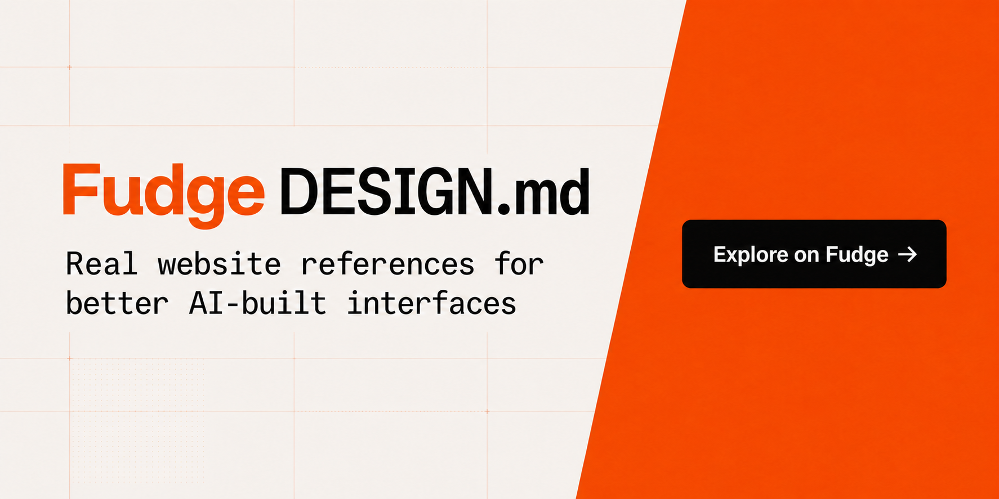

# Fudge DESIGN.md

DESIGN.md guides built from real websites saved in [Fudge](https://design.withfudge.com/).
Drop one into a project to give your coding agent a more specific visual
direction grounded in real references.

Each guide:

- summarizes the website's visual direction, typography, colors and layout;
- shows the representative captured pages used to understand the design;
- separates captured details from interpretation;
- links to the corresponding Fudge conversation;
- links to the captured pages used to build it.

The collection updates when a substantial domain guide is accepted and
published through Fudge. Thin generated drafts are not listed as guides.

[View the live migration status](status/STATUS.md) for every domain in the
collection, including blocked jobs and completed replacements.

## Guides

<!-- DESIGN_MD_INDEX_START -->
### 100x.bot

100x.bot presents automation as a calm editorial product rather than a technical dashboard. The shell is light, spacious, and easy to scan; the expressive work happens in oversized claims, softly colored feature cards, monochrome portraits, and occasional hand-drawn illustrations. Near-black sections and a few saturated actions create punctuation without turning the whole page into a high-energy SaaS gradient.

[Open guide](design-md/100x.bot.md) · [View the Fudge conversation](https://design.withfudge.com/share/100x.bot-design)

### 10er.com

10er makes creator funding feel direct rather than financial. A near-black field, oversized centered language, one saturated blue action, and a small yellow circular mark create the shell. Creator work—podcast covers, portraits, expressive type, and vivid artwork—provides the personality. The product chrome remains spare.

[Open guide](design-md/10er.com.md) · [View the Fudge conversation](https://design.withfudge.com/share/10er.com-design)

### 15th.plus-ex.com

15th.plus-ex.com uses a strict monochrome language that feels closer to a poster series than a conventional site. The page relies on enormous Neuehaasgrotesk type, very open canvas, and a recurring contrast between white presentation stages and black editorial stages. The largest elements are not decorative containers but letterforms, numbers, and simple geometric marks: a plus sign, an X, diagonal slats, and a few rounded image cards.

[Open guide](design-md/15th.plus-ex.com.md) · [View the Fudge conversation](https://design.withfudge.com/share/15th.plus-ex.com-design)

### 1600.agency

1600.agency is built like a refined sales page for a motion studio: bright, centered, and unusually calm for a service site that sells speed and output. The page leans on a white canvas, a heavy black display face, and one warm orange action color. That combination makes the hero feel crisp and confident rather than decorative. The interface never becomes busy; the visual message is always easy to scan because the strongest elements are held in a small number of large, rounded containers.

[Open guide](design-md/1600.agency.md) · [View the Fudge conversation](https://design.withfudge.com/share/1600.agency-design)

### 205.tf

205.tf works like a type specimen bench: austere, exact, and dominated by the letterforms themselves. The interface does not try to soften the foundry experience. It gives the typefaces a pale stage, black rules, and enough open space for the specimen to carry the page. The result feels closer to a working archive or proofing table than to a marketing site.

[Open guide](design-md/205.tf.md) · [View the Fudge conversation](https://design.withfudge.com/share/205.tf-design)

### 21st.dev

21st.dev uses a dark catalog grammar with a product-tool feel. The page hierarchy is built from a nearly black shell, thin grid lines, compact labels, and a large number of framed previews. It reads less like a marketing site and more like a workstation for browsing, filtering, and opening UI assets.

[Open guide](design-md/21st.dev.md) · [View the Fudge conversation](https://design.withfudge.com/share/21st.dev-design)

### 80.lv

80.lv reads as a calm editorial network rather than a loud magazine or a product landing page. The page uses a soft off-white canvas, white card surfaces, and a restrained olive-black text color so that the artwork inside each story card carries the energy. The interface never competes with the thumbnails; it frames them.

[Open guide](design-md/80.lv.md) · [View the Fudge conversation](https://design.withfudge.com/share/80.lv-design)

### a16z.com

a16z.com is an editorial home page with a single-minded hierarchy. The page opens with a burgundy brand bar, then hands nearly all attention to a giant gold medallion illustration set against a deep navy field. The central image is not decoration; it is the anchor that gives the page its tone. Text stays sparse and direct, with a short invitation and one primary action beneath the artwork. The lower section settles into a restrained footer that carries the logotype, a brief tagline, social links, and legal text.

[Open guide](design-md/a16z.com.md) · [View the Fudge conversation](https://design.withfudge.com/share/a16z.com-design)

### aaa24.a24films.com

AAA24 is designed like a membership brochure that keeps turning into a utility interface. The dominant mood is severe and controlled: near-black content pages, warm paper footers, thin rules, and large Nb International Pro type that carries most of the personality. The system feels less like a glossy subscription funnel and more like an editorial film club with a strict grid.

[Open guide](design-md/aaa24.a24films.com.md) · [View the Fudge conversation](https://design.withfudge.com/share/aaa24.a24films.com-design)

### abcdinamo.com

abcdinamo.com is a type-foundry storefront with the confidence of a studio archive and the restraint of a catalog. The design puts specimen type first, then surrounds it with compact utilities, pill-shaped actions, and very little ornamental framing. The site alternates between large typographic statements and orderly product or article grids, so the user always knows whether they are looking at a specimen, a purchase flow, or a store section.

[Open guide](design-md/abcdinamo.com.md) · [View the Fudge conversation](https://design.withfudge.com/share/abcdinamo.com-design)

### account.nothing.tech

Nothing Account login is built as a spare, centered sign-in page with almost no decorative noise. A pale field holds a single white card, and the card does most of the work: it concentrates attention, separates the task from the page chrome, and keeps the layout from spreading outward. The page feels measured rather than minimal in an abstract sense. Every visible part has a job, and every job stays small.

[Open guide](design-md/account.nothing.tech.md) · [View the Fudge conversation](https://design.withfudge.com/share/account.nothing.tech-design)

### accounts.theatlantic.com

The Atlantic accounts surface is editorial commerce: a magazine-toned subscription experience that uses a black or near-black hero band, cream paper fields, and white cards to sell access with restraint. The page does not feel like a utility checkout. It feels like a premium publishing offer laid out with the confidence of a print spread.

[Open guide](design-md/accounts.theatlantic.com.md) · [View the Fudge conversation](https://design.withfudge.com/share/accounts.theatlantic.com-design)

### accounts.x.ai

accounts.x.ai is a dark account console, not a marketing page. The system keeps almost everything in black, charcoal, white, and muted gray, then uses a cool blue-gray illustration panel to soften the strictness of the shell. The result feels technical, calm, and controlled.

[Open guide](design-md/accounts.x.ai.md) · [View the Fudge conversation](https://design.withfudge.com/share/accounts.x.ai-design)

### acoup.blog

acoup.blog is a dark reading site built around long historical essays. The page does not try to feel modern in a glossy sense. It feels bookish, steady, and slightly ceremonial. The strongest visual move is the pairing of a decorative serif for titles with Georgia for the reading copy, all placed on a cool charcoal-violet field. The accent color is a dusty pink-lilac that repeats in the navigation, links, tag cloud, and small utility details. That single accent carries most of the brand energy, so the rest of the interface can stay quiet.

[Open guide](design-md/acoup.blog.md) · [View the Fudge conversation](https://design.withfudge.com/share/acoup.blog-design)

### actualidea.com

actualidea.com presents an editorial portfolio system built around magazine spreads rather than conventional web cards. The page field is white, the chrome is sparse, and the spreads carry nearly all of the personality. That balance is what makes the layout feel printed: the interface stays quiet enough that the artwork can be loud, whether the page is warm and photographic, stark and monochrome, or saturated with pink, cyan, and rainbow stripes.

[Open guide](design-md/actualidea.com.md) · [View the Fudge conversation](https://design.withfudge.com/share/actualidea.com-design)

### adject.ai

adject.ai presents a predominantly dark surface treatment in the captured pages. The system is anchored by `#000000`, `#0a0a0a`, and `#ffffff`, with typography led by **System**, **Google Sans 18 Pt**, **Rebond Grotesque**, and **Inter**. The guide below names reusable design roles only where the captured evidence supports them.

[Open guide](design-md/adject.ai.md) · [View the Fudge conversation](https://design.withfudge.com/share/adject.ai-design)

### ads.pinterest.com

ads.pinterest.com presents a predominantly dark surface treatment in the captured pages. The system is anchored by `#000000`, `#211922`, and `#ffffff`, with typography led by **Pin Sans Mac Os**. The guide below names reusable design roles only where the captured evidence supports them.

[Open guide](design-md/ads.pinterest.com.md) · [View the Fudge conversation](https://design.withfudge.com/share/ads.pinterest.com-design)

### adventureson.band

Adventureson.band is designed like a short sequence of music chapters rather than a conventional site. Each chapter keeps the interface quiet and lets one visual idea carry the page: a blurred gradient cover stage, a white release sheet with watercolor rings, and a dark portrait biography panel. The result feels handmade and intimate, with the work itself doing most of the talking.

[Open guide](design-md/adventureson.band.md) · [View the Fudge conversation](https://design.withfudge.com/share/adventureson.band-design)

### aeon.co

Aeon looks like a magazine that trusts the argument more than the interface. The page is built from a white reading field, a black hero stage, and occasional pale support bands that reset the mood without adding decorative clutter. Acaca carries the large editorial statements: essay titles, donation headlines, and other moments that need authority. Atlas Grotesk handles the rest of the page with a plain, measured voice. Atlas Typewriter appears only in small labels, utility copy, and compact controls, which gives the site a faint print-shop edge without turning the interface nostalgic.

[Open guide](design-md/aeon.co.md) · [View the Fudge conversation](https://design.withfudge.com/share/aeon.co-design)

### affectablesleep.com

Affectable Sleep presents itself as a quiet premium hardware brand, not a busy ecommerce catalog. The page language is restrained, but the visual system is not plain: a deep teal stage, warm off-white backgrounds, pale cream panels, and a vivid yellow button give the site a clear rhythm. The photography carries most of the mood. Portraits place the headband in a lived-in setting, while product detail pages pull the device into a cleaner studio-like field. Across the site, the type stays light and compact, so the hardware and the color blocks do the expressive work.

[Open guide](design-md/affectablesleep.com.md) · [View the Fudge conversation](https://design.withfudge.com/share/affectablesleep.com-design)

### agentation.dev

agentation.dev presents a predominantly light surface treatment in the captured pages. The system is anchored by `#000000`, `#111111`, and `#ffffff`, with typography led by **Inter** and **System**. The guide below names reusable design roles only where the captured evidence supports them.

[Open guide](design-md/agentation.dev.md) · [View the Fudge conversation](https://design.withfudge.com/share/agentation.dev-design)

### agenticui.net

agenticui.net presents a mixed light and dark surface treatment in the captured pages. The system is anchored by `#000000`, `#616161`, and `#191919`, with typography led by **Geist**, **Inter**, and **Ibm Plex Mono**. The guide below names reusable design roles only where the captured evidence supports them.

[Open guide](design-md/agenticui.net.md) · [View the Fudge conversation](https://design.withfudge.com/share/agenticui.net-design)

### agently.dev

Agently.dev presents itself as a bright agent-workforce product rather than a dark developer console. The page is built from a pale canvas, strong black type, white rounded cards, and a violet system that carries the primary calls to action. Large headings say the most important thing first, then smaller supporting text explains the agent model in plain language. The result feels polished, energetic, and startup-forward without leaning on visual noise.

[Open guide](design-md/agently.dev.md) · [View the Fudge conversation](https://design.withfudge.com/share/agently.dev-design)

### ahrefs.com

Ahrefs uses a two-mode brand rhythm. The commercial pages swing between a saturated blue field and stark white product surfaces, while the storytelling pages move into black and charcoal with orange actions as the constant signal. The result is direct and assertive, not decorative: a visitor gets a large claim, a clear action, and a dense block of product truth without extra framing.

[Open guide](design-md/ahrefs.com.md) · [View the Fudge conversation](https://design.withfudge.com/share/ahrefs.com-design)

### ahrefsevolve.com

ahrefsevolve.com presents a predominantly dark surface treatment in the captured pages. The system is anchored by `#000000`, `#ffffff`, and `#1b1f23`, with typography led by **Inter**, **Evolve V 20**, **Evolve**, and **Evolve Draft**. The guide below names reusable design roles only where the captured evidence supports them.

[Open guide](design-md/ahrefsevolve.com.md) · [View the Fudge conversation](https://design.withfudge.com/share/ahrefsevolve.com-design)

### ai-sdk.dev

ai-sdk.dev is designed as a dark developer homepage that sells the product through code, not illustration. The page uses a pure black canvas, soft gray supporting text, and very bright white primary copy. The first impression is a centered hero with a large statement, a compact command pill, and a code-and-chat demo underneath. That structure makes the site feel like a landing page and a working product walkthrough at the same time.

[Open guide](design-md/ai-sdk.dev.md) · [View the Fudge conversation](https://design.withfudge.com/share/ai-sdk.dev-design)

### aino.agency

aino.agency presents a mixed light and dark surface treatment in the captured pages. The system is anchored by `#000000`, `#f5f5f0`, and `#181818`, with typography led by **Abc Diatype Plus**. The guide below names reusable design roles only where the captured evidence supports them.

[Open guide](design-md/aino.agency.md) · [View the Fudge conversation](https://design.withfudge.com/share/aino.agency-design)

### airbnb.ca

Airbnb.ca uses a restrained marketplace system: white canvas, soft gray separators, rounded cards, and one saturated red action color that stays reserved for the most important controls. The page puts stay photography and maps ahead of decoration. Titles are compact, labels are quiet, and the interface reads as a booking tool rather than a promotional landing page.

[Open guide](design-md/airbnb.ca.md) · [View the Fudge conversation](https://design.withfudge.com/share/airbnb.ca-design)

### aiverse.design

aiverse.design presents AI products as a calm editorial library rather than a glossy software pitch. The page stays on a warm paper canvas, then layers in black serif statements, soft beige cards, and rounded screenshots that do the explanatory work. The result feels collected and instructive: one part playbook, one part gallery, with enough breathing room that each example can read as a small exhibit.

[Open guide](design-md/aiverse.design.md) · [View the Fudge conversation](https://design.withfudge.com/share/aiverse.design-design)

### algebrica.org

Algebrica is a restrained mathematical knowledge base with the tone of a printed reference shelf translated to the web. The page language stays calm: white and very pale gray surfaces, thin dividers, black text, muted gray metadata, and the classic blue link as the only sharp color accent. The design does not depend on heavy illustration or decorative motion. It relies on order, spacing, and a careful hierarchy between navigation, chapter cards, and long reading surfaces.

[Open guide](design-md/algebrica.org.md) · [View the Fudge conversation](https://design.withfudge.com/share/algebrica.org-design)

### aljazeera.com

Al Jazeera’s article pages use a severe, uncluttered newsroom frame. The page is mostly white, the headline is black and heavy, the summary line shifts into a serif voice, and the control row stays narrow and quiet beneath the text. Story photography then takes over the width of the column, so the page reads as a sequence of headline, context, tools, and lead image rather than as a dense news dashboard.

[Open guide](design-md/aljazeera.com.md) · [View the Fudge conversation](https://design.withfudge.com/share/aljazeera.com-design)

### allbirds.com

Allbirds presents itself as a calm, nature-led commerce system. The page feels open, grounded, and edited rather than promotional. Warm off-white canvas, black and charcoal text, and soft rounded media frames keep the interface quiet so the photography can do most of the work. The brand story is told through wide landscape imagery, product-in-use pictures, and large campaign statements that sit inside the image rather than beside it.

[Open guide](design-md/allbirds.com.md) · [View the Fudge conversation](https://design.withfudge.com/share/allbirds.com-design)

### almost-pearfect.com

almost-pearfect.com presents a mixed light and dark surface treatment in the captured pages. The system is anchored by `#282828`, `#000000`, and `#ffffff`, with typography led by **Applesystem**, **Trjn Da Vinci 70**, **Acumin Concept**, and **Helvetica Neue**. The guide below names reusable design roles only where the captured evidence supports them.

[Open guide](design-md/almost-pearfect.com.md) · [View the Fudge conversation](https://design.withfudge.com/share/almost-pearfect.com-design)

### alpine.inc

Alpine.inc uses a strict two-mode language: bright white paper sections with faint mountain linework, then near-black product stages that feel like a quiet showroom. The page avoids busy ornament and lets contrast do most of the work. On white surfaces, black serif headlines, muted gray support text, and small line icons carry the message. On dark surfaces, the same hierarchy flips to white copy with a single cool blue action color and soft glowing accents around the product cards.

[Open guide](design-md/alpine.inc.md) · [View the Fudge conversation](https://design.withfudge.com/share/alpine.inc-design)

### ami.dev

ami.dev presents a predominantly dark surface treatment in the captured pages. The system is anchored by `#000000`, `#ffffff`, and `#434343`, with typography led by **Inter** and **System**. The guide below names reusable design roles only where the captured evidence supports them.

[Open guide](design-md/ami.dev.md) · [View the Fudge conversation](https://design.withfudge.com/share/ami.dev-design)

### ampcode.com

ampcode.com presents a predominantly dark surface treatment in the captured pages. The system is anchored by `#000000`, `#f6f6f6`, and `#f6fff5`, with typography led by **System**, **Iowan Old Style**, **Poly Sans**, **Perfectly Nineties**, **Consolas**, **Sagittaire**, and **Tx 02**. The guide below names reusable design roles only where the captured evidence supports them.

[Open guide](design-md/ampcode.com.md) · [View the Fudge conversation](https://design.withfudge.com/share/ampcode.com-design)

### analytics.google.com

Google Analytics uses a restrained enterprise dashboard language: light gray page ground, nearly white cards, thin borders, blue interactive accents, and dense metric layout. The page is organized around numbers first, then charts, then short navigation surfaces. Nothing competes with the data. The whole system feels like a control room built for long sessions rather than a marketing page built for quick attention.

[Open guide](design-md/analytics.google.com.md) · [View the Fudge conversation](https://design.withfudge.com/share/analytics.google.com-design)

### animaapp.com

Anima’s homepage is a dark, controlled landing page built around a single centered idea: a serif headline, a prompt-like composer, and a strip of example thumbnails that prove the product’s range. The whole page sits on a charcoal field, so the pink announcement bar, white header controls, and blue-violet hero accents read as deliberate signals instead of decoration. The mood is polished and technical at once. It feels like a design tool presenting itself with studio lighting, not like a generic software homepage.

[Open guide](design-md/animaapp.com.md) · [View the Fudge conversation](https://design.withfudge.com/share/animaapp.com-design)

### anthropic.com

Anthropic’s captured pages are calm, editorial, and unusually unhurried for a technology company. A warm, paper-like field gives dense black typography, carefully separated columns, sparse diagrams, and occasional cinematic feature art room to work. The recurring tension is useful: crisp sans-serif display and navigation provide present-day clarity, while serif article copy gives long-form ideas a literary cadence.

[Open guide](design-md/anthropic.com.md) · [View the Fudge conversation](https://design.withfudge.com/share/anthropic.com-design)

### antigravity.google

Antigravity uses a spare Google product register: a white page surface, a thin top navigation line, one strong headline or status message, and a compact set of pill actions. The system feels controlled rather than decorative. Most pages rely on one large typographic anchor, a few small links, and lots of open space so the message can land without competing elements.

[Open guide](design-md/antigravity.google.md) · [View the Fudge conversation](https://design.withfudge.com/share/antigravity.google-design)

### anytype.io

Anytype's marketing pages rely on a strict contrast between white canvas and black content, then soften that contrast with a single pink accent and a set of restrained gray steps. The result feels editorial rather than software-like. The page often starts with a large serif line, then moves into compact sans-serif sections, then returns to a dark band for emphasis. That rhythm is the core of the system: one strong statement, one plain explanation, one clear action.

[Open guide](design-md/anytype.io.md) · [View the Fudge conversation](https://design.withfudge.com/share/anytype.io-design)

### aol.com

aol.com presents a predominantly dark surface treatment in the captured pages. The system is anchored by `#000000`, `#232a31`, and `#12161c`, with typography led by **Basis Grotesque Pro**. The guide below names reusable design roles only where the captured evidence supports them.

[Open guide](design-md/aol.com.md) · [View the Fudge conversation](https://design.withfudge.com/share/aol.com-design)

### apara.design

Apara uses a spare portfolio language: white canvas, black type, rounded cards, and one electric-blue action color. The page feels calm rather than empty because the sections are built from strong contrasts: centered hero statements against wide blank fields, dark process panels against light utility areas, and product imagery that brings saturated color into an otherwise neutral system. The result is a studio presentation that feels careful, editorial, and slightly theatrical without becoming busy.

[Open guide](design-md/apara.design.md) · [View the Fudge conversation](https://design.withfudge.com/share/apara.design-design)

### api-dashboard.search.brave.com

api-dashboard.search.brave.com is a dark, state-driven developer console. The page is built to make account status, plan selection, API keys, and verification messages easy to scan before anything else. The design stays disciplined: one strong lavender-blue action color, charcoal surfaces with tight borders, and compact Inter text that keeps long forms and pricing blocks readable without decorative noise.

[Open guide](design-md/api-dashboard.search.brave.com.md) · [View the Fudge conversation](https://design.withfudge.com/share/api-dashboard.search.brave.com-design)

### api.scira.ai

api.scira.ai presents a predominantly light surface treatment in the captured pages. The system is anchored by the recorded surface and text values, with typography led by the captured fallback stack. The guide below names reusable design roles only where the captured evidence supports them.

[Open guide](design-md/api.scira.ai.md) · [View the Fudge conversation](https://design.withfudge.com/share/api.scira.ai-design)

### app.base44.com

Base44’s visual language is a desktop builder with two competing stages: a calm editing workspace and a bright purchase sheet. The workspace is mostly white, lightly bordered, and sparse. The purchase sheet sits on top as a large rounded panel with a thin cool outline, a vivid orange promotion band, and four plan cards lined up with even spacing. The result feels like a software workspace that briefly turns into a sales moment without changing its core grammar.

[Open guide](design-md/app.base44.com.md) · [View the Fudge conversation](https://design.withfudge.com/share/app.base44.com-design)

### app.brevo.com

app.brevo.com presents a mixed light and dark surface treatment in the captured pages. The system is anchored by `#1b1b1b`, `#ffffff`, and `#e3e3e3`, with typography led by **Inter**, **Applesystem**, **Times**, and **Arial**. The guide below names reusable design roles only where the captured evidence supports them.

[Open guide](design-md/app.brevo.com.md) · [View the Fudge conversation](https://design.withfudge.com/share/app.brevo.com-design)

### app.flora.ai

FLORA reads as a dark creative workspace rather than a conventional app shell. The main canvas is almost black, the content sits in soft charcoal cards, and the page gives ideas room to float across a dotted field. That open ground is important: the layout feels roomy even when several cards, notices, and utility chips are present at once.

[Open guide](design-md/app.flora.ai.md) · [View the Fudge conversation](https://design.withfudge.com/share/app.flora.ai-design)

### app.fourmula.ai

Formula AI uses a dark, controlled studio language rather than a bright marketing system. The page surface is almost entirely black and charcoal, with white type, muted gray support text, and one hot orange action color that carries the whole interface. The start screen centers a short promise over a dense grid of figure tiles, while the create-asset workspace turns the same visual language into a split production layout with a left staging column and a larger right adjustment column.

[Open guide](design-md/app.fourmula.ai.md) · [View the Fudge conversation](https://design.withfudge.com/share/app.fourmula.ai-design)

### app.paper.design

Paper's Files home is a restrained desktop workspace built like a file system rather than a marketing page. The dark canvas stays in control, the rail is narrow, and the main area keeps a wide open working field around a small number of file tiles. That emptiness is part of the design language: content is given room, chrome stays quiet, and the interface never competes with the documents.

[Open guide](design-md/app.paper.design.md) · [View the Fudge conversation](https://design.withfudge.com/share/app.paper.design-design)

### app.quiver.ai

app.quiver.ai presents a predominantly light surface treatment in the captured pages. The system is anchored by `#000000`, `#f8f8f8`, and `#e5e5e5`, with typography led by **Geist**, **Applesystem**, and **Geist Mono**. The guide below names reusable design roles only where the captured evidence supports them.

[Open guide](design-md/app.quiver.ai.md) · [View the Fudge conversation](https://design.withfudge.com/share/app.quiver.ai-design)

### app.reve.com

app.reve.com presents a predominantly dark surface treatment in the captured pages. The system is anchored by the recorded surface and text values, with typography led by the captured fallback stack. The guide below names reusable design roles only where the captured evidence supports them.

[Open guide](design-md/app.reve.com.md) · [View the Fudge conversation](https://design.withfudge.com/share/app.reve.com-design)

### app.squareup.com

Square’s sign-in page is a split-stage gate: a calm white authentication surface on one side and a black brand panel on the other. The white side keeps the task plain and procedural. The black side carries the product story through stacked benefit lines and a floating software screenshot. The page feels serious because it uses very few colors, very little ornament, and a tight rhythm of text, controls, and spacing.

[Open guide](design-md/app.squareup.com.md) · [View the Fudge conversation](https://design.withfudge.com/share/app.squareup.com-design)

### app.standards.site

app.standards.site is a dark, disciplined design-ops workspace. The page treats the interface like a specimen sheet: a huge wordmark, stacked typography samples, layout previews, and setup controls all sit on a black field with only a few bright accents. The result feels serious and editorial rather than playful. Most of the page is empty space, which gives the labels, cards, and buttons enough room to feel deliberate.

[Open guide](design-md/app.standards.site.md) · [View the Fudge conversation](https://design.withfudge.com/share/app.standards.site-design)

### app.subframe.com

Subframe's UI is a clean white operating surface with a narrow dark accent and a lot of breathing room. The page treats each feature as a specimen: a context menu, a calendar, an accordion row, a pricing block, or a connection panel gets its own framed stage and enough empty space to read as a product sample rather than a marketing illustration.

[Open guide](design-md/app.subframe.com.md) · [View the Fudge conversation](https://design.withfudge.com/share/app.subframe.com-design)

### app.superdesign.dev

Superdesign is a dark workshop interface for building pages from prompts, templates, and imported references. The home screen is spare and centered: a small top bar, a concise headline, a large prompt composer, then a row of recent-project cards. The launch screen shifts into a split workspace, with a dense control column on the left and a bright preview stage on the right. That contrast is the brand: operational chrome in near-black grays, then a theatrical generated result that can turn stark, loud, and poster-like.

[Open guide](design-md/app.superdesign.dev.md) · [View the Fudge conversation](https://design.withfudge.com/share/app.superdesign.dev-design)

### app.superlist.com

app.superlist.com presents a predominantly dark surface treatment in the captured pages. The system is anchored by the recorded surface and text values, with typography led by the captured fallback stack. The guide below names reusable design roles only where the captured evidence supports them.

[Open guide](design-md/app.superlist.com.md) · [View the Fudge conversation](https://design.withfudge.com/share/app.superlist.com-design)

### app.useorigin.com

Origin uses a nocturnal finance aesthetic: near-black surfaces, white type, cyan actions, and a smaller violet accent for status and emphasis. The page language is confident and controlled rather than glossy. Large display type carries the marketing message, while the in-app screens compress the same brand into compact cards, rails, and overlays. The result is not a generic banking dashboard; it is a premium product shell that feels designed for concentration.

[Open guide](design-md/app.useorigin.com.md) · [View the Fudge conversation](https://design.withfudge.com/share/app.useorigin.com-design)

### apple.com

Apple Store commerce is precise, spacious, neutral, and conversion-focused. A broad white canvas gives product imagery and purchase information room to breathe; near-black and cool-gray type create hierarchy; blue is reserved for links and decisive actions. Softly rounded pale panels frame the hardware, while one-pixel dividers organize configuration, checkout, FAQ, and legal information without turning the interface into a field of cards.

[Open guide](design-md/apple.com.md) · [View the Fudge conversation](https://design.withfudge.com/share/apple.com-design)

### arcee.ai

arcee.ai presents a predominantly light surface treatment in the captured pages. The system is anchored by `#0a0a0a` and `#008c8c`, with typography led by **Sora** and **Noto Serif Armenian**. The guide below names reusable design roles only where the captured evidence supports them.

[Open guide](design-md/arcee.ai.md) · [View the Fudge conversation](https://design.withfudge.com/share/arcee.ai-design)

### arcraiders.com

ARC Raiders pairs a utilitarian game-world identity with unusually disciplined editorial structure. It alternates between cinematic, character-led dark campaign surfaces and a warm paper-like reading surface for news. The signature is not a generic sci-fi dashboard: it is bold black type, cream stock, gold action color, and a repeated stack of bright signal stripes.

[Open guide](design-md/arcraiders.com.md) · [View the Fudge conversation](https://design.withfudge.com/share/arcraiders.com-design)

### arena.ai

Arena is a dark benchmarking interface built around comparison and ranking. The page feels technical before it feels decorative. A left rail handles navigation and filters, the center of the page carries dense ranked content, and the battle views split into opposing panes that keep the comparison in plain sight. The layout is organized for fast scanning, not for leisurely reading.

[Open guide](design-md/arena.ai.md) · [View the Fudge conversation](https://design.withfudge.com/share/arena.ai-design)

### artefakt.mov

Artefakt.mov uses a severe black-and-white language that feels closer to a quiet film slate than to a conventional studio homepage. The page is built around one central idea: the brand mark is the main event, and everything else stays small, precise, and far enough away to avoid stealing attention. A narrow band of utility text sits along the top edge, the middle of the screen holds a dense character-built wordmark, and the bottom edge closes with short captions that read like credits. The result is controlled, spare, and deliberately unsentimental.

[Open guide](design-md/artefakt.mov.md) · [View the Fudge conversation](https://design.withfudge.com/share/artefakt.mov-design)

### artera.ae

artera.ae presents a predominantly dark surface treatment in the captured pages. The system is anchored by `#000000`, `#ffffff`, and `#f3f3f3`, with typography led by **Inter**. The guide below names reusable design roles only where the captured evidence supports them.

[Open guide](design-md/artera.ae.md) · [View the Fudge conversation](https://design.withfudge.com/share/artera.ae-design)

### artificialanalysis.ai

artificialanalysis.ai presents a predominantly light surface treatment in the captured pages. The system is anchored by `#000000`, `#ffffff`, and `#43003b`, with typography led by **Suisse Intl**, **System**, **Victor Serif Basic**, and **Applesystem**. The guide below names reusable design roles only where the captured evidence supports them.

[Open guide](design-md/artificialanalysis.ai.md) · [View the Fudge conversation](https://design.withfudge.com/share/artificialanalysis.ai-design)

### artsandculture.google.com

Google Arts & Culture uses a restrained, gallery-like interface that keeps the artwork, collection tiles, and editorial headings in front of the chrome. The page is almost always built on a white canvas with thin dark or gray rules, compact navigation text, and blue links or actions. The result feels like a museum index rather than a product dashboard: quiet around the edges, image-forward in the middle, and highly legible at a glance.

[Open guide](design-md/artsandculture.google.com.md) · [View the Fudge conversation](https://design.withfudge.com/share/artsandculture.google.com-design)

### artstation.com

artstation.com presents a predominantly dark surface treatment in the captured pages. The system is anchored by `#bebec2` and `#000000`, with typography led by **Inter**. The guide below names reusable design roles only where the captured evidence supports them.

[Open guide](design-md/artstation.com.md) · [View the Fudge conversation](https://design.withfudge.com/share/artstation.com-design)

### ashmolean.org

Ashmolean.org is built like a museum publication translated into a web page: calm, documentary, and easy to scan. The site keeps a white or warm off-white canvas, black primary text, and a restrained sage-green action color. Photography carries the emotional load. The interface stays quiet around it, using centered cards, pale section bands, and long horizontal margins to make each page feel spacious rather than busy.

[Open guide](design-md/ashmolean.org.md) · [View the Fudge conversation](https://design.withfudge.com/share/ashmolean.org-design)

### assistant-ui.com

assistant-ui.com presents a predominantly dark surface treatment in the captured pages. The system is anchored by `#000000`, `#fafafa`, and `#cdd6f4`, with typography led by **Geist** and **System**. The guide below names reusable design roles only where the captured evidence supports them.

[Open guide](design-md/assistant-ui.com.md) · [View the Fudge conversation](https://design.withfudge.com/share/assistant-ui.com-design)

### astrnt.co

ASTRNT presents hiring and admissions as a serious enterprise landing page. The composition opens with a narrow navy strip, then moves into a white header row and a broad hero. The tone is controlled and corporate rather than playful. There are no soft gradients, decorative flourishes, or crowded card stacks competing for attention. The page relies on scale, spacing, and a few sharp brand colors to carry the message.

[Open guide](design-md/astrnt.co.md) · [View the Fudge conversation](https://design.withfudge.com/share/astrnt.co-design)

### astrotypes.com

Astrotypes is a type specimen page with a deliberately narrow visual range. The page does not try to create a full brand world; it lets the type families do the work. Each section reads like a large light card placed on a slightly darker canvas, with a single oversized face name, one calm supporting sentence, and a small command strip anchored near the bottom. The repetition is the identity: the same frame, the same spacing rhythm, and the same restrained controls make each font family feel like a member of one system rather than a separate poster.

[Open guide](design-md/astrotypes.com.md) · [View the Fudge conversation](https://design.withfudge.com/share/astrotypes.com-design)

### audio.com

audio.com presents a mixed light and dark surface treatment in the captured pages. The system is anchored by `#f2f1f4`, `#1a1825`, and `#ffffff`, with typography led by **Poppins**. The guide below names reusable design roles only where the captured evidence supports them.

[Open guide](design-md/audio.com.md) · [View the Fudge conversation](https://design.withfudge.com/share/audio.com-design)

### aura.build

aura.build presents a predominantly dark surface treatment in the captured pages. The system is anchored by `#000000`, `#fafafa`, and `#ffffff`, with typography led by **Inter**. The guide below names reusable design roles only where the captured evidence supports them.

[Open guide](design-md/aura.build.md) · [View the Fudge conversation](https://design.withfudge.com/share/aura.build-design)

### autogram.id

Autogram’s page language is spare, bright, and centered. The whole screen reads as a soft white field with one decisive message in the middle, then a loose ring of floating tiles that makes the product feel social rather than dashboard-like. The copy stays short. The whitespace stays large. The surrounding objects carry much of the personality: app icons, document cards, small photo crops, and colored name chips all sit outside the main text column like pinned notes around a workstation.

[Open guide](design-md/autogram.id.md) · [View the Fudge conversation](https://design.withfudge.com/share/autogram.id-design)

### awwwards.com

awwwards.com presents a predominantly dark surface treatment in the captured pages. The system is anchored by `#222222`, `#000000`, and `#ededed`, with typography led by **Inter Tight**. The guide below names reusable design roles only where the captured evidence supports them.

[Open guide](design-md/awwwards.com.md) · [View the Fudge conversation](https://design.withfudge.com/share/awwwards.com-design)

### baked.design

baked.design presents a mixed light and dark surface treatment in the captured pages. The system is anchored by `#000000`, `#ffffff`, and `#404040`, with typography led by **System** and **Inter**. The guide below names reusable design roles only where the captured evidence supports them.

[Open guide](design-md/baked.design.md) · [View the Fudge conversation](https://design.withfudge.com/share/baked.design-design)

### baremettle.com

baremettle.com presents a predominantly dark surface treatment in the captured pages. The system is anchored by `#d7d7d7`, `#818181`, and `#ffffff`, with typography led by the captured fallback stack. The guide below names reusable design roles only where the captured evidence supports them.

[Open guide](design-md/baremettle.com.md) · [View the Fudge conversation](https://design.withfudge.com/share/baremettle.com-design)

### base-ui.com

base-ui.com presents a predominantly dark surface treatment in the captured pages. The system is anchored by `#ededed` and `#000000`, with typography led by **Times**, **Die Grotesk A**, and **Die Grotesk B**. The guide below names reusable design roles only where the captured evidence supports them.

[Open guide](design-md/base-ui.com.md) · [View the Fudge conversation](https://design.withfudge.com/share/base-ui.com-design)

### base44.com

base44.com presents a mixed light and dark surface treatment in the captured pages. The system is anchored by `#000000`, `#ffffff`, and `#faf9f7`, with typography led by **Arial**, **Times**, **Madefor**, **Bcnovaticacyr**, **Stk Miso**, **Wix Madefor**, **Applesystem**, and **Wix Madefor Vf**. The guide below names reusable design roles only where the captured evidence supports them.

[Open guide](design-md/base44.com.md) · [View the Fudge conversation](https://design.withfudge.com/share/base44.com-design)

### baselight.ai

baselight.ai presents a predominantly dark surface treatment in the captured pages. The system is anchored by `#000000`, `#111111`, and `#ffffff`, with typography led by **Wanted Sans Std**, **Nohemi**, **Wanted Sans**, and **Inter**. The guide below names reusable design roles only where the captured evidence supports them.

[Open guide](design-md/baselight.ai.md) · [View the Fudge conversation](https://design.withfudge.com/share/baselight.ai-design)

### baseten.co

baseten.co presents a mixed light and dark surface treatment in the captured pages. The system is anchored by `#000000`, `#ffffff`, and `#f5f8f4`, with typography led by **System**, **Neue Alte Grotesk**, and **Chivo Mono**. The guide below names reusable design roles only where the captured evidence supports them.

[Open guide](design-md/baseten.co.md) · [View the Fudge conversation](https://design.withfudge.com/share/baseten.co-design)

### bbc.com

bbc.com presents a predominantly dark surface treatment in the captured pages. The system is anchored by `#000000`, `#202224`, and `#141414`, with typography led by **Times**, **By Dalton Maag Ltd**, and **Times New Roman**. The guide below names reusable design roles only where the captured evidence supports them.

[Open guide](design-md/bbc.com.md) · [View the Fudge conversation](https://design.withfudge.com/share/bbc.com-design)

### behance.net

behance.net presents a predominantly dark surface treatment in the captured pages. The system is anchored by `#000000`, `#191919`, and `#ffffff`, with typography led by **Acumin Vf**, **Acuminpro**, and **Acuminprowide**. The guide below names reusable design roles only where the captured evidence supports them.

[Open guide](design-md/behance.net.md) · [View the Fudge conversation](https://design.withfudge.com/share/behance.net-design)

### bengalturf.yolasite.com

bengalturf.yolasite.com presents a predominantly dark surface treatment in the captured pages. The system is anchored by `#afce7c`, `#496c10`, and `#3e5c0e`, with typography led by **Arial** and **Georgia**. The guide below names reusable design roles only where the captured evidence supports them.

[Open guide](design-md/bengalturf.yolasite.com.md) · [View the Fudge conversation](https://design.withfudge.com/share/bengalturf.yolasite.com-design)

### besimple.ai

besimple.ai presents a predominantly light surface treatment in the captured pages. The system is anchored by `#252322`, `#eeece8`, and `#e8e3df`, with typography led by **Suisse Intl**, **N Type 82**, **Applesystem**, and **System**. The guide below names reusable design roles only where the captured evidence supports them.

[Open guide](design-md/besimple.ai.md) · [View the Fudge conversation](https://design.withfudge.com/share/besimple.ai-design)

### betterstack.com

betterstack.com presents a predominantly dark surface treatment in the captured pages. The system is anchored by `#939db8`, `#000000`, and `#0f101a`, with typography led by **Helvetica Now**. The guide below names reusable design roles only where the captured evidence supports them.

[Open guide](design-md/betterstack.com.md) · [View the Fudge conversation](https://design.withfudge.com/share/betterstack.com-design)

### bfl.ai

bfl.ai presents a mixed light and dark surface treatment in the captured pages. The system is anchored by `#ffffff`, `#07130e`, and `#556659`, with typography led by **Instrument Sans** and **Ibm Plex Mono**. The guide below names reusable design roles only where the captured evidence supports them.

[Open guide](design-md/bfl.ai.md) · [View the Fudge conversation](https://design.withfudge.com/share/bfl.ai-design)

### binary.so

binary.so presents a predominantly dark surface treatment in the captured pages. The system is anchored by `#000000`, `#0f172a`, and `#586a84`, with typography led by **System** and **Basier Square**. The guide below names reusable design roles only where the captured evidence supports them.

[Open guide](design-md/binary.so.md) · [View the Fudge conversation](https://design.withfudge.com/share/binary.so-design)

### bkid.co

bkid.co presents a predominantly light surface treatment in the captured pages. The system is anchored by `#444444`, `#ffffff`, and `#888888`, with typography led by **Helvetica Neue**, **Applesystem**, **System**, and **Helvetica**. The guide below names reusable design roles only where the captured evidence supports them.

[Open guide](design-md/bkid.co.md) · [View the Fudge conversation](https://design.withfudge.com/share/bkid.co-design)

### bland.ai

bland.ai presents a predominantly light surface treatment in the captured pages. The system is anchored by `#151515`, `#ffffff`, and `#f6f6f1`, with typography led by **Söhne** and **Applesystem**. The guide below names reusable design roles only where the captured evidence supports them.

[Open guide](design-md/bland.ai.md) · [View the Fudge conversation](https://design.withfudge.com/share/bland.ai-design)

### blindsight.space

blindsight.space presents a predominantly dark surface treatment in the captured pages. The system is anchored by `#000000`, `#0000ee`, and `#ffffff`, with typography led by **Begum** and **Px Grotesk**. The guide below names reusable design roles only where the captured evidence supports them.

[Open guide](design-md/blindsight.space.md) · [View the Fudge conversation](https://design.withfudge.com/share/blindsight.space-design)

### blog.google

blog.google presents a predominantly dark surface treatment in the captured pages. The system is anchored by `#5f6368`, `#000000`, and `#364043`, with typography led by **Google Sans**. The guide below names reusable design roles only where the captured evidence supports them.

[Open guide](design-md/blog.google.md) · [View the Fudge conversation](https://design.withfudge.com/share/blog.google-design)

### bolt.new

bolt.new presents a mixed light and dark surface treatment in the captured pages. The system is anchored by `#ffffff`, `#171719`, and `#fefeff`, with typography led by **Inter**. The guide below names reusable design roles only where the captured evidence supports them.

[Open guide](design-md/bolt.new.md) · [View the Fudge conversation](https://design.withfudge.com/share/bolt.new-design)

### braintrust.dev

braintrust.dev presents a predominantly dark surface treatment in the captured pages. The system is anchored by `#000000`, `#ffffff`, and `#ededed`, with typography led by **Braintrust V 2**, **Inter**, **Suisse Intl Mono**, and **System**. The guide below names reusable design roles only where the captured evidence supports them.

[Open guide](design-md/braintrust.dev.md) · [View the Fudge conversation](https://design.withfudge.com/share/braintrust.dev-design)

### brave.com

brave.com presents a predominantly light surface treatment in the captured pages. The system is anchored by `#1c1c1d`, `#fafafb`, and `#ffffff`, with typography led by **Poppins**, **Inter**, **Flecha M**, **Applesystem**, and **System**. The guide below names reusable design roles only where the captured evidence supports them.

[Open guide](design-md/brave.com.md) · [View the Fudge conversation](https://design.withfudge.com/share/brave.com-design)

### brookings.edu

brookings.edu presents a predominantly light surface treatment in the captured pages. The system is anchored by `#191919`, `#ffffff`, and `#022a4e`, with typography led by **Inter** and **Applesystem**. The guide below names reusable design roles only where the captured evidence supports them.

[Open guide](design-md/brookings.edu.md) · [View the Fudge conversation](https://design.withfudge.com/share/brookings.edu-design)

### browserbase.com

browserbase.com presents a mixed light and dark surface treatment in the captured pages. The system is anchored by `#000000`, `#100d0d`, and `#ffffff`, with typography led by **Pp Neue Montreal**, **Pp Supply Sans**, and **Applesystem**. The guide below names reusable design roles only where the captured evidence supports them.

[Open guide](design-md/browserbase.com.md) · [View the Fudge conversation](https://design.withfudge.com/share/browserbase.com-design)

### browseros.com

browseros.com presents a mixed light and dark surface treatment in the captured pages. The system is anchored by `#666666`, `#d9d7d7`, and `#261107`, with typography led by **Geist** and **Junicode**. The guide below names reusable design roles only where the captured evidence supports them.

[Open guide](design-md/browseros.com.md) · [View the Fudge conversation](https://design.withfudge.com/share/browseros.com-design)

### bspk.xyz

bspk.xyz presents a predominantly light surface treatment in the captured pages. The system is anchored by `#333333`, with typography led by **Chivo** and **Courier New**. The guide below names reusable design roles only where the captured evidence supports them.

[Open guide](design-md/bspk.xyz.md) · [View the Fudge conversation](https://design.withfudge.com/share/bspk.xyz-design)

### bud.app

bud.app presents a predominantly dark surface treatment in the captured pages. The system is anchored by `#000000`, `#ffffff`, and `#f7f7f7`, with typography led by **Circular**. The guide below names reusable design roles only where the captured evidence supports them.

[Open guide](design-md/bud.app.md) · [View the Fudge conversation](https://design.withfudge.com/share/bud.app-design)

### builtwith.kit.com

builtwith.kit.com presents a predominantly light surface treatment in the captured pages. The system is anchored by `#f2efe9`, `#1e1e1e`, and `#ffffff`, with typography led by **Libre Franklin** and **Kit Sans**. The guide below names reusable design roles only where the captured evidence supports them.

[Open guide](design-md/builtwith.kit.com.md) · [View the Fudge conversation](https://design.withfudge.com/share/builtwith.kit.com-design)

### c82.net

c82.net presents a predominantly light surface treatment in the captured pages. The system is anchored by `#000000`, `#f2efe9`, and `#ffffff`, with typography led by **Alegreya Sans**, **Rigsolidinlinesolo**, **Times**, **Rigsolidfill**, **Rigsolidreverse**, **Applesystem**, and **Arial**. The guide below names reusable design roles only where the captured evidence supports them.

[Open guide](design-md/c82.net.md) · [View the Fudge conversation](https://design.withfudge.com/share/c82.net-design)

### caffeine.ai

caffeine.ai presents a predominantly dark surface treatment in the captured pages. The system is anchored by `#000000`, `#fbfbfb`, and `#f6f6f6`, with typography led by **Sohne**. The guide below names reusable design roles only where the captured evidence supports them.

[Open guide](design-md/caffeine.ai.md) · [View the Fudge conversation](https://design.withfudge.com/share/caffeine.ai-design)

### camo.com

camo.com presents a predominantly dark surface treatment in the captured pages. The system is anchored by `#000000`, `#dce2f4`, and `#ffffff`, with typography led by **Inter**. The guide below names reusable design roles only where the captured evidence supports them.

[Open guide](design-md/camo.com.md) · [View the Fudge conversation](https://design.withfudge.com/share/camo.com-design)

### campaignlive.co.uk

campaignlive.co.uk presents a mixed light and dark surface treatment in the captured pages. The system is anchored by `#000000`, `#1c1c1c`, and `#ffffff`, with typography led by **Freightpro**, **Tabletgothicnarrow**, and **Lato**. The guide below names reusable design roles only where the captured evidence supports them.

[Open guide](design-md/campaignlive.co.uk.md) · [View the Fudge conversation](https://design.withfudge.com/share/campaignlive.co.uk-design)

### canadaspends.com

Canada Spends is built like a public finance report turned into an interactive dashboard. The interface is calm, compact, and data-led: warm cream canvas, charcoal headings, white cards, and a single deep red accent that carries emphasis without turning the page theatrical. The visual tone is serious but not severe. It reads like a civic briefing where the numbers are meant to be scanned, compared, and trusted.

[Open guide](design-md/canadaspends.com.md) · [View the Fudge conversation](https://design.withfudge.com/share/canadaspends.com-design)

### cap.so

cap.so presents a predominantly dark surface treatment in the captured pages. The system is anchored by `#000000`, `#ffffff`, and `#71717a`, with typography led by **Neue Montreal** and **System**. The guide below names reusable design roles only where the captured evidence supports them.

[Open guide](design-md/cap.so.md) · [View the Fudge conversation](https://design.withfudge.com/share/cap.so-design)

### capacity.so

capacity.so presents a predominantly dark surface treatment in the captured pages. The system is anchored by `#000000`, `#fafafa`, and `#ffffff`, with typography led by **System** and **Noto Sans**. The guide below names reusable design roles only where the captured evidence supports them.

[Open guide](design-md/capacity.so.md) · [View the Fudge conversation](https://design.withfudge.com/share/capacity.so-design)

### capy.ai

Capy uses a hard-edged developer-marketing language with a toy-like mascot, but the layout stays disciplined and serious. The site relies on a narrow patterned rail, a large white main canvas, tall condensed headlines, and a single teal accent that carries the whole action system. The result feels closer to an opinionated tool brand than to a playful illustration site. The mascot adds personality, but the real structure comes from strict alignment, thin black rules, and boxed surfaces.

[Open guide](design-md/capy.ai.md) · [View the Fudge conversation](https://design.withfudge.com/share/capy.ai-design)

### carcard.arible.co

Carcard uses two closely related visual modes: a warm editorial intro band and a calm card-scanning workspace. The first mode is poster-like and condensed, with small upper labels, a large serif statement, and a thin closing rule. The second mode is a clean single-page utility surface with a centered hero, a black primary action, a dashed upload area, a search field, and a vertical list of scanned cards. The system feels quiet rather than minimal for its own sake. It keeps the structure legible, gives the brand a soft literary tone, and uses very little color beyond ink, muted neutrals, paper white, and a green success state.

[Open guide](design-md/carcard.arible.co.md) · [View the Fudge conversation](https://design.withfudge.com/share/carcard.arible.co-design)

### cargo.site

Cargo is a dark, spare site-builder system that lets content carry the visual weight. The frame stays quiet: tiny top navigation, faint separators, restrained icons, and a low-contrast left rail in the editor shell. The pages that matter are either huge black poster-like statements or dense grids of site thumbnails. That split is the brand.

[Open guide](design-md/cargo.site.md) · [View the Fudge conversation](https://design.withfudge.com/share/cargo.site-design)

### catala-lang.org

Catala’s visual system reads like an academic paper that has been turned into a website without losing its discipline. The page sits on a pale paper ground, uses serif display type for the main claims, and keeps the rest of the interface in a clean sans-serif voice. Gold-sand buttons, thin rules, and ruled white panels carry the interface, while code examples supply the site’s strongest visual contrast. The overall feeling is calm, exact, and document-oriented rather than promotional.

[Open guide](design-md/catala-lang.org.md) · [View the Fudge conversation](https://design.withfudge.com/share/catala-lang.org-design)

### cavalry.scenegroup.co

Cavalry’s pages are built like motion-design posters translated into web layout. The system prefers a small set of loud ingredients: black or charcoal fields, white type, one saturated purple, one neon green, thin rules, and clean pill buttons. The page does not rely on softness or ornamental texture. Instead, it uses hard edges, strong contrast, and large type to make each section feel like a separate chapter.

[Open guide](design-md/cavalry.scenegroup.co.md) · [View the Fudge conversation](https://design.withfudge.com/share/cavalry.scenegroup.co-design)

### cavalry.studio

cavalry.studio presents a predominantly dark surface treatment in the captured pages. The system is anchored by `#000000`, `#ffffff`, and `#6437ff`, with typography led by **Canva Sans** and **Arial**. The guide below names reusable design roles only where the captured evidence supports them.

[Open guide](design-md/cavalry.studio.md) · [View the Fudge conversation](https://design.withfudge.com/share/cavalry.studio-design)

### celesteduffy.com

celesteduffy.com presents a predominantly dark surface treatment in the captured pages. The system is anchored by `#000000`, `#200603`, and `#f4f2ea`, with typography led by **Almarai** and **Libre Baskerville**. The guide below names reusable design roles only where the captured evidence supports them.

[Open guide](design-md/celesteduffy.com.md) · [View the Fudge conversation](https://design.withfudge.com/share/celesteduffy.com-design)

### cerebras.ai

Cerebras uses a strict industrial visual language. The page is driven by dark fields, white type, and a small orange accent that marks taxonomy, links, and emphasis. The mood is not polished consumer-tech; it is hardware-first, dense, and exact. Large areas of near-black and deep brown create the frame, while bright white content sheets break in as contrast when the site needs a readable list or form. That shift from dark stage to white sheet is one of the clearest structural cues in the system.

[Open guide](design-md/cerebras.ai.md) · [View the Fudge conversation](https://design.withfudge.com/share/cerebras.ai-design)

### chainlift.io

Chainlift presents LiftKit as a precision-minded UI framework. The page is almost entirely dark, then punctuates that darkness with pale lavender actions and a saturated blue footer. The result feels technical, controlled, and a little severe, but never noisy. Large headlines do the heavy lifting; the supporting text stays compact and deliberately plain.

[Open guide](design-md/chainlift.io.md) · [View the Fudge conversation](https://design.withfudge.com/share/chainlift.io-design)

### chatgpt.com

chatgpt.com presents a mixed light and dark surface treatment in the captured pages. The system is anchored by `#ffffff`, `#000000`, and `#0d0d0d`, with typography led by **Applesystembody**, **System**, **Open Ai Sans**, and **Applesystem**. The guide below names reusable design roles only where the captured evidence supports them.

[Open guide](design-md/chatgpt.com.md) · [View the Fudge conversation](https://design.withfudge.com/share/chatgpt.com-design)

### christies.com

Christie’s homepage feels like an auction catalog arranged with the pacing of an editorial magazine. White ground, black and charcoal text, and wide image fields do most of the work. The design depends on restraint: a narrow palette, thin rules, small utility text, and long horizontal compositions that let art, objects, and real-estate imagery stay central.

[Open guide](design-md/christies.com.md) · [View the Fudge conversation](https://design.withfudge.com/share/christies.com-design)

### clarity.microsoft.com

clarity.microsoft.com presents a predominantly dark surface treatment in the captured pages. The system is anchored by `#000000`, `#323130`, and `#eaeaff`, with typography led by **Segoe Ui**. The guide below names reusable design roles only where the captured evidence supports them.

[Open guide](design-md/clarity.microsoft.com.md) · [View the Fudge conversation](https://design.withfudge.com/share/clarity.microsoft.com-design)

### classy.md

Classy.md is a dark writing surface built around restraint. The page is almost entirely text, with a centered reading column, a black field that never tries to become decorative, and a small amount of top chrome. The visual system does not lean on depth, glossy treatment, or layered panels. It relies on measure, rhythm, and contrast. That makes the site feel closer to an editor, a notes app, or a typed manifesto than a conventional SaaS landing page.

[Open guide](design-md/classy.md.md) · [View the Fudge conversation](https://design.withfudge.com/share/classy.md-design)

### claude.ai

Claude.ai uses two tightly related surface families. The dark family handles the login and first-contact pages: near-black backgrounds, soft white type, rounded cards, and one strong blue action color. The light family handles the workspace, design-system, and palette pages: warm paper backgrounds, black ink, pale dividers, and compact controls with more air around them. The product stays coherent because the same serif-and-sans typographic split runs through both modes. The mood changes, but the structure does not.

[Open guide](design-md/claude.ai.md) · [View the Fudge conversation](https://design.withfudge.com/share/claude.ai-design)

### claude.com

Claude.com is built as a dark editorial brand system rather than a conventional SaaS shell. The page stays close to a near-black charcoal canvas, then lifts the important actions and media into paper-colored pills, thin ruled rows, and rounded image frames. The visual weight belongs to the serif headlines, which are large, pale, and tightly composed. Sans text stays quiet, compact, and functional. Terracotta appears as a brand signal and a small accent, not as a flood of color.

[Open guide](design-md/claude.com.md) · [View the Fudge conversation](https://design.withfudge.com/share/claude.com-design)

### claura.framer.ai

Claura feels like a calm studio landing page built around one warm visual temperature. The page uses a cream canvas, dark espresso text, and a single brown action color, then lets large serif headlines and rounded panels carry the brand. The tone is polished but not glossy, with enough softness in the surfaces to keep the page approachable.

[Open guide](design-md/claura.framer.ai.md) · [View the Fudge conversation](https://design.withfudge.com/share/claura.framer.ai-design)

### clubhouse.com

clubhouse.com presents a predominantly dark surface treatment in the captured pages. The system is anchored by `#000000`, `#242420`, and `#ffe450`, with typography led by **Nunito** and **Gt Maru**. The guide below names reusable design roles only where the captured evidence supports them.

[Open guide](design-md/clubhouse.com.md) · [View the Fudge conversation](https://design.withfudge.com/share/clubhouse.com-design)

### cmux.com

cmux uses a restrained, developer-first visual language built from monochrome surfaces, compact type, and a very narrow centered content column. The page does not try to feel expansive or decorative. It feels precise, controlled, and intentionally quiet. The strongest impression comes from contrast: bright white pages against near-black pages, filled pills against outlined pills, and dense testimonial text against generous empty margins.

[Open guide](design-md/cmux.com.md) · [View the Fudge conversation](https://design.withfudge.com/share/cmux.com-design)

### cobe.vercel.app

COBE reads like a developer library built around one live object. A white field gives the globe room, while the rest of the page turns into a sequence of compact reference surfaces: tabs, prompt bars, code cards, a control panel, and a table of options. The mood is precise and slightly playful because the globe, stickers, and label cards carry the personality while the UI chrome stays thin and rectilinear.

[Open guide](design-md/cobe.vercel.app.md) · [View the Fudge conversation](https://design.withfudge.com/share/cobe.vercel.app-design)

### coda.co

Coda’s merchant-of-record landing page is built as a two-mode finance story. The first mode is a dark hero stage with a huge cream claim on a charcoal background, a compact light action, and a glossy green sculptural form that fills the right half of the viewport. The second mode is a warm cream directory sheet that opens the product family into a multicolumn grid without changing the page’s quiet tone. Between those modes sits an olive-gray feature band that explains the offer in shorter, utility-shaped blocks.

[Open guide](design-md/coda.co.md) · [View the Fudge conversation](https://design.withfudge.com/share/coda.co-design)

### codepen.io

codepen.io presents a predominantly dark surface treatment in the captured pages. The system is anchored by `#000000`, `#ffffff`, and `#2c303a`, with typography led by **Lato**, **Telefon**, **Type**, **Sf Mono**, and **Arial**. The guide below names reusable design roles only where the captured evidence supports them.

[Open guide](design-md/codepen.io.md) · [View the Fudge conversation](https://design.withfudge.com/share/codepen.io-design)

### cofounder.co

cofounder.co presents a mixed light and dark surface treatment in the captured pages. The system is anchored by `#171717`, `#000000`, and `#0a0a0a`, with typography led by **Tt Neoris**, **Af Another Sans**, **Pp Mondwest**, and **Geist Mono**. The guide below names reusable design roles only where the captured evidence supports them.

[Open guide](design-md/cofounder.co.md) · [View the Fudge conversation](https://design.withfudge.com/share/cofounder.co-design)

### cognee.ai

Cognee uses a dark, technical stage with a restrained editorial tone. The page sits on a black field and overlays a faint square grid, then drops in scattered lavender tile clusters so the background feels computational without becoming noisy. The main message is carried by oversized Twk Lausanne headlines, short supporting lines, and compact pill controls. That balance gives the site a calm but forceful presence: the copy leads, while the grid and violet accents supply the brand signal.

[Open guide](design-md/cognee.ai.md) · [View the Fudge conversation](https://design.withfudge.com/share/cognee.ai-design)

### cohere.com

cohere.com presents a predominantly light surface treatment in the captured pages. The system is anchored by `#000000`, `#212121`, and `#ffffff`, with typography led by **By Christian Mengelt Team 77**, **Inter**, **Applesystem**, **Cohere**, and **Cohere Mono**. The guide below names reusable design roles only where the captured evidence supports them.

[Open guide](design-md/cohere.com.md) · [View the Fudge conversation](https://design.withfudge.com/share/cohere.com-design)

### console.groq.com

GroqCloud's home screen is a dark developer console with a tight, centered reading column and a strong hierarchy of rounded panels. The page does not try to feel expansive or decorative. It feels controlled, technical, and compact: a top bar, a sign-in block, and a model directory stacked one after another inside a charcoal shell. The visual mood comes from restraint. Most surfaces sit inside the same black-to-stone family, while the brightest notes are the coral brand accent and the pale blue secondary highlight.

[Open guide](design-md/console.groq.com.md) · [View the Fudge conversation](https://design.withfudge.com/share/console.groq.com-design)

### contentformcontext.com

Contentformcontext.com presents the SBS 8 News case study as a spare editorial page rather than a product landing page. The system depends on contrast, alignment, and a narrow type ladder. Nearly everything sits on a black field, with white titles, muted gray paragraphs, and one saturated blue accent that marks the strongest visual break in the layout.

[Open guide](design-md/contentformcontext.com.md) · [View the Fudge conversation](https://design.withfudge.com/share/contentformcontext.com-design)

### continue.dev

continue.dev presents a predominantly dark surface treatment in the captured pages. The system is anchored by `#000000`, `#020817`, and `#fafafa`, with typography led by **Ibm Plex Sans**, **Manrope**, **System**, **Ibm Plex Mono**, and **Monaco**. The guide below names reusable design roles only where the captured evidence supports them.

[Open guide](design-md/continue.dev.md) · [View the Fudge conversation](https://design.withfudge.com/share/continue.dev-design)

### coolors.co

coolors.co presents a mixed light and dark surface treatment in the captured pages. The system is anchored by `#0a0a0a`, `#000000`, and `#ffffff`, with typography led by **Inter** and **Google Sans Code**. The guide below names reusable design roles only where the captured evidence supports them.

[Open guide](design-md/coolors.co.md) · [View the Fudge conversation](https://design.withfudge.com/share/coolors.co-design)

### cora.computer

cora.computer presents a predominantly dark surface treatment in the captured pages. The system is anchored by `#000000`, `#ffffff`, and `#117bc8`, with typography led by **Switzer**, **Times**, and **Signifier**. The guide below names reusable design roles only where the captured evidence supports them.

[Open guide](design-md/cora.computer.md) · [View the Fudge conversation](https://design.withfudge.com/share/cora.computer-design)

### cosmic-ray.tv

cosmic-ray.tv presents a predominantly light surface treatment in the captured pages. The system is anchored by `#000000` and `#ffffff`, with typography led by **Apple Sd Gothic Neo**, **Tn**, **Applesystem**, and **Neue Haas Grotesk**. The guide below names reusable design roles only where the captured evidence supports them.

[Open guide](design-md/cosmic-ray.tv.md) · [View the Fudge conversation](https://design.withfudge.com/share/cosmic-ray.tv-design)

### cosmos.so

cosmos.so presents a mixed light and dark surface treatment in the captured pages. The system is anchored by `#000000`, `#f7f5f3`, and `#302f47`, with typography led by **Cosmos Oracle**. The guide below names reusable design roles only where the captured evidence supports them.

[Open guide](design-md/cosmos.so.md) · [View the Fudge conversation](https://design.withfudge.com/share/cosmos.so-design)

### cotool.ai

cotool.ai presents a predominantly dark surface treatment in the captured pages. The system is anchored by `#0d0d0d`, `#000000`, and `#1f1f1f`, with typography led by **Font** and **Moderat Serif**. The guide below names reusable design roles only where the captured evidence supports them.

[Open guide](design-md/cotool.ai.md) · [View the Fudge conversation](https://design.withfudge.com/share/cotool.ai-design)

### cracked.com

cracked.com presents a predominantly dark surface treatment in the captured pages. The system is anchored by `#000000`, `#f5f5f5`, and `#005f6b`, with typography led by **Neuekabel**, **Open Sans**, and **Source Serif 4**. The guide below names reusable design roles only where the captured evidence supports them.

[Open guide](design-md/cracked.com.md) · [View the Fudge conversation](https://design.withfudge.com/share/cracked.com-design)

### craftwork.design

craftwork.design presents a predominantly dark surface treatment in the captured pages. The system is anchored by `#000000`, `#ffffff`, and `#a0a0a0`, with typography led by **Font** and **Noto Sans**. The guide below names reusable design roles only where the captured evidence supports them.

[Open guide](design-md/craftwork.design.md) · [View the Fudge conversation](https://design.withfudge.com/share/craftwork.design-design)

### crazycreative.design

crazycreative.design presents a predominantly dark surface treatment in the captured pages. The system is anchored by `#000000`, `#ff66c8`, and `#ffffff`, with typography led by **System**, **Bricolage Grotesque 96 Pt**, and **Bricolage Grotesque**. The guide below names reusable design roles only where the captured evidence supports them.

[Open guide](design-md/crazycreative.design.md) · [View the Fudge conversation](https://design.withfudge.com/share/crazycreative.design-design)

### creem.io

creem.io presents a mixed light and dark surface treatment in the captured pages. The system is anchored by `#000000`, `#fafaf9`, and `#111827`, with typography led by **Geist**, **Gasoek One**, and **System**. The guide below names reusable design roles only where the captured evidence supports them.

[Open guide](design-md/creem.io.md) · [View the Fudge conversation](https://design.withfudge.com/share/creem.io-design)

### crowdreply.io

crowdreply.io presents a predominantly dark surface treatment in the captured pages. The system is anchored by `#000000`, `#ffffff`, and `#46484d`, with typography led by **System**, **Inter**, **Outfit**, and **Crisp Noto Sans**. The guide below names reusable design roles only where the captured evidence supports them.

[Open guide](design-md/crowdreply.io.md) · [View the Fudge conversation](https://design.withfudge.com/share/crowdreply.io-design)

### crowprose.com

crowprose.com presents a predominantly light surface treatment in the captured pages. The system is anchored by `#1a1a1a` and `#4d4d4d`, with typography led by **Din 1451 Std**. The guide below names reusable design roles only where the captured evidence supports them.

[Open guide](design-md/crowprose.com.md) · [View the Fudge conversation](https://design.withfudge.com/share/crowprose.com-design)

### curator.io

curator.io presents a predominantly dark surface treatment in the captured pages. The system is anchored by `#000000`, `#0000ee`, and `#ffffff`, with typography led by **System** and **Geist**. The guide below names reusable design roles only where the captured evidence supports them.

[Open guide](design-md/curator.io.md) · [View the Fudge conversation](https://design.withfudge.com/share/curator.io-design)

### cursor.com

cursor.com presents a predominantly dark surface treatment in the captured pages. The system is anchored by `#edecec`, `#000000`, and `#e4e4e4`, with typography led by **Cursor Gothic**, **System**, **Berkeley Mono Variable**, and **Sf Pro**. The guide below names reusable design roles only where the captured evidence supports them.

[Open guide](design-md/cursor.com.md) · [View the Fudge conversation](https://design.withfudge.com/share/cursor.com-design)

### cypherpunkbooks.com

cypherpunkbooks.com presents a mixed light and dark surface treatment in the captured pages. The system is anchored by `#1c1b12`, `#f1ecd9`, and `#ffffe1`, with typography led by **Inter**, **Times**, **Alpha Lyrae**, and **Applesystem**. The guide below names reusable design roles only where the captured evidence supports them.

[Open guide](design-md/cypherpunkbooks.com.md) · [View the Fudge conversation](https://design.withfudge.com/share/cypherpunkbooks.com-design)

### daisyui.com

daisyui.com presents a predominantly light surface treatment in the captured pages. The system is anchored by `#ffffff`, with typography led by **Vazirmatn**, **Outfit**, and **System**. The guide below names reusable design roles only where the captured evidence supports them.

[Open guide](design-md/daisyui.com.md) · [View the Fudge conversation](https://design.withfudge.com/share/daisyui.com-design)

### dandad.org

dandad.org presents a predominantly light surface treatment in the captured pages. The system is anchored by `#161616`, `#ffffff`, and `#ebe8f5`, with typography led by **D** and **Applesystem**. The guide below names reusable design roles only where the captured evidence supports them.

[Open guide](design-md/dandad.org.md) · [View the Fudge conversation](https://design.withfudge.com/share/dandad.org-design)

### danielsun.space

danielsun.space presents a mixed light and dark surface treatment in the captured pages. The system is anchored by `#000000`, `#f5f5f5`, and `#767676`, with typography led by **System**, **Inter**, **Reddit Sans Condensed**, **Caveat**, and **Inter Tight**. The guide below names reusable design roles only where the captured evidence supports them.

[Open guide](design-md/danielsun.space.md) · [View the Fudge conversation](https://design.withfudge.com/share/danielsun.space-design)

### dany.works

dany.works presents a predominantly dark surface treatment in the captured pages. The system is anchored by `#000000`, `#1a1a1a`, and `#b4b4b4`, with typography led by **Fragment Mono**. The guide below names reusable design roles only where the captured evidence supports them.

[Open guide](design-md/dany.works.md) · [View the Fudge conversation](https://design.withfudge.com/share/dany.works-design)

### dash.cloudflare.com

dash.cloudflare.com presents a predominantly dark surface treatment in the captured pages. The system is anchored by `#d9d9d9`, `#030303`, and `#000000`, with typography led by **Inter**, **Applesystem**, and **Paper Mono**. The guide below names reusable design roles only where the captured evidence supports them.

[Open guide](design-md/dash.cloudflare.com.md) · [View the Fudge conversation](https://design.withfudge.com/share/dash.cloudflare.com-design)

### dash.dropbox.com

dash.dropbox.com presents a predominantly dark surface treatment in the captured pages. The system is anchored by `#000000`, `#736c64`, and `#ffffff`, with typography led by **Atlas Grotesk** and **Sharp Grotesk Db Cyr 20**. The guide below names reusable design roles only where the captured evidence supports them.

[Open guide](design-md/dash.dropbox.com.md) · [View the Fudge conversation](https://design.withfudge.com/share/dash.dropbox.com-design)

### dashboard.exa.ai

dashboard.exa.ai presents a predominantly light surface treatment in the captured pages. The system is anchored by `#000000`, `#ffffff`, and `#fbfcfd`, with typography led by **Abc Diatype Plus**, **Proto Mono**, **Applesystem**, **Aeonik**, and **Abc Arizona Flare**. The guide below names reusable design roles only where the captured evidence supports them.

[Open guide](design-md/dashboard.exa.ai.md) · [View the Fudge conversation](https://design.withfudge.com/share/dashboard.exa.ai-design)

### dashboard.internetcomputer.org

dashboard.internetcomputer.org presents a predominantly dark surface treatment in the captured pages. The system is anchored by `#ffffff`, `#000000`, and `#1c1c1c`, with typography led by **By Laurenz Brunner**, **Roboto**, and **System**. The guide below names reusable design roles only where the captured evidence supports them.

[Open guide](design-md/dashboard.internetcomputer.org.md) · [View the Fudge conversation](https://design.withfudge.com/share/dashboard.internetcomputer.org-design)

### dashboard.mux.com

dashboard.mux.com presents a mixed light and dark surface treatment in the captured pages. The system is anchored by `#242628`, `#e2e4dd`, and `#000000`, with typography led by **Aeonik** and **Jet Brains Mono**. The guide below names reusable design roles only where the captured evidence supports them.

[Open guide](design-md/dashboard.mux.com.md) · [View the Fudge conversation](https://design.withfudge.com/share/dashboard.mux.com-design)

### davidprotein.com

davidprotein.com presents a predominantly dark surface treatment in the captured pages. The system is anchored by `#000000`, `#ffffff`, and `#6e6e6e`, with typography led by **System**, **Suisse Intl**, **Instrument Serif**, **Abc Monument Grotesk Mono Unlicensed**, and **Arial**. The guide below names reusable design roles only where the captured evidence supports them.

[Open guide](design-md/davidprotein.com.md) · [View the Fudge conversation](https://design.withfudge.com/share/davidprotein.com-design)

### dedcool.com

dedcool.com presents a mixed light and dark surface treatment in the captured pages. The system is anchored by `#000000`, `#373330`, and `#f0f0f0`, with typography led by **Universal Sans** and **Messina Sans Mono**. The guide below names reusable design roles only where the captured evidence supports them.

[Open guide](design-md/dedcool.com.md) · [View the Fudge conversation](https://design.withfudge.com/share/dedcool.com-design)

### deepjudge.ai

deepjudge.ai presents a predominantly dark surface treatment in the captured pages. The system is anchored by `#1a1a1a`, `#242422`, and `#ffffff`, with typography led by **Font**. The guide below names reusable design roles only where the captured evidence supports them.

[Open guide](design-md/deepjudge.ai.md) · [View the Fudge conversation](https://design.withfudge.com/share/deepjudge.ai-design)

### deepmind.google

deepmind.google presents a predominantly dark surface treatment in the captured pages. The system is anchored by `#f8f9fc`, `#121317`, and `#000000`, with typography led by **Google Sans Flex**, **Times**, **Applesystem**, **Google Symbols**, and **Google Symbols Rounded 48 Pt**. The guide below names reusable design roles only where the captured evidence supports them.

[Open guide](design-md/deepmind.google.md) · [View the Fudge conversation](https://design.withfudge.com/share/deepmind.google-design)

### deepwiki.com

deepwiki.com presents a predominantly dark surface treatment in the captured pages. The system is anchored by `#333333`, `#000000`, and `#666666`, with typography led by **Geist** and **System**. The guide below names reusable design roles only where the captured evidence supports them.

[Open guide](design-md/deepwiki.com.md) · [View the Fudge conversation](https://design.withfudge.com/share/deepwiki.com-design)

### deezer.com

deezer.com presents a predominantly dark surface treatment in the captured pages. The system is anchored by `#000000`, `#fdfcfe`, and `#0f0d13`, with typography led by **Inter**, **Deezer Brand**, and **Deezer Product**. The guide below names reusable design roles only where the captured evidence supports them.

[Open guide](design-md/deezer.com.md) · [View the Fudge conversation](https://design.withfudge.com/share/deezer.com-design)

### delve.co

delve.co presents a predominantly dark surface treatment in the captured pages. The system is anchored by `#ffffff`, `#000000`, and `#0c0c0c`, with typography led by **Inter Tight** and **Overused Grotesk**. The guide below names reusable design roles only where the captured evidence supports them.

[Open guide](design-md/delve.co.md) · [View the Fudge conversation](https://design.withfudge.com/share/delve.co-design)

### demo.refero.design

demo.refero.design presents a predominantly dark surface treatment in the captured pages. The system is anchored by `#fafafa`, `#000000`, and `#a1a1aa`, with typography led by **System**. The guide below names reusable design roles only where the captured evidence supports them.

[Open guide](design-md/demo.refero.design.md) · [View the Fudge conversation](https://design.withfudge.com/share/demo.refero.design-design)

### departuremono.com

departuremono.com presents a mixed light and dark surface treatment in the captured pages. The system is anchored by `#444444`, `#eeeeee`, and `#222222`, with typography led by **Departure Mono** and **Applesystem**. The guide below names reusable design roles only where the captured evidence supports them.

[Open guide](design-md/departuremono.com.md) · [View the Fudge conversation](https://design.withfudge.com/share/departuremono.com-design)

### designerdailyreport.com

designerdailyreport.com presents a predominantly dark surface treatment in the captured pages. The system is anchored by `#000000`, `#ffffff`, and `#2f2d5e`, with typography led by **Izmir**, **Albra**, **Applesystem**, and **Izmir Narrow**. The guide below names reusable design roles only where the captured evidence supports them.

[Open guide](design-md/designerdailyreport.com.md) · [View the Fudge conversation](https://design.withfudge.com/share/designerdailyreport.com-design)

### designme.agency

designme.agency presents a predominantly dark surface treatment in the captured pages. The system is anchored by `#000000`, `#ffffff`, and `#080b14`, with typography led by **System**, **Inter**, and **Jet Brains Mono**. The guide below names reusable design roles only where the captured evidence supports them.

[Open guide](design-md/designme.agency.md) · [View the Fudge conversation](https://design.withfudge.com/share/designme.agency-design)

### designsystems.surf

designsystems.surf presents a mixed light and dark surface treatment in the captured pages. The system is anchored by `#000000`, `#ffffff`, and `#f5f5f5`, with typography led by **System**, **Inter**, and **Ibm Plex Mono**. The guide below names reusable design roles only where the captured evidence supports them.

[Open guide](design-md/designsystems.surf.md) · [View the Fudge conversation](https://design.withfudge.com/share/designsystems.surf-design)

### designwithvibbbes.com

designwithvibbbes.com presents a predominantly dark surface treatment in the captured pages. The system is anchored by `#000000`, `#b4c3e6`, and `#ffffff`, with typography led by **Plus Jakarta Sans**, **Made Outer Sans**, and **Roboto Mono**. The guide below names reusable design roles only where the captured evidence supports them.

[Open guide](design-md/designwithvibbbes.com.md) · [View the Fudge conversation](https://design.withfudge.com/share/designwithvibbbes.com-design)

### developer.chrome.com

developer.chrome.com presents a predominantly dark surface treatment in the captured pages. The system is anchored by `#f8f9fa`, `#000000`, and `#202124`, with typography led by **Google Sans 18 Pt**. The guide below names reusable design roles only where the captured evidence supports them.

[Open guide](design-md/developer.chrome.com.md) · [View the Fudge conversation](https://design.withfudge.com/share/developer.chrome.com-design)

### developers.google.com

developers.google.com presents a mixed light and dark surface treatment in the captured pages. The system is anchored by `#202124`, `#dadce0`, and `#1a73e8`, with typography led by **Roboto**, **Google Sans 18 Pt**, and **Material Symbols Outlined**. The guide below names reusable design roles only where the captured evidence supports them.

[Open guide](design-md/developers.google.com.md) · [View the Fudge conversation](https://design.withfudge.com/share/developers.google.com-design)

### dfinity.org

dfinity.org presents a predominantly dark surface treatment in the captured pages. The system is anchored by `#000000`, `#0e031f`, and `#ffffff`, with typography led by **By Laurenz Brunner** and **Circular Xx**. The guide below names reusable design roles only where the captured evidence supports them.

[Open guide](design-md/dfinity.org.md) · [View the Fudge conversation](https://design.withfudge.com/share/dfinity.org-design)

### diabrowser.com

diabrowser.com presents a mixed light and dark surface treatment in the captured pages. The system is anchored by `#000000` and `#ebebeb`, with typography led by **Abc Oracle**, **Exposure 0**, **Exposure 20**, and **Exposure**. The guide below names reusable design roles only where the captured evidence supports them.

[Open guide](design-md/diabrowser.com.md) · [View the Fudge conversation](https://design.withfudge.com/share/diabrowser.com-design)

### digg.com

digg.com presents a mixed light and dark surface treatment in the captured pages. The system is anchored by `#000000`, `#171616`, and `#e3e0d8`, with typography led by **Roobert Mono Vf**, **Roobert Vf**, and **Applesystem**. The guide below names reusable design roles only where the captured evidence supports them.

[Open guide](design-md/digg.com.md) · [View the Fudge conversation](https://design.withfudge.com/share/digg.com-design)

### discord.com

discord.com presents a predominantly dark surface treatment in the captured pages. The system is anchored by `#000000`, `#efeff1`, and `#97979f`, with typography led by **Gg Sans**. The guide below names reusable design roles only where the captured evidence supports them.

[Open guide](design-md/discord.com.md) · [View the Fudge conversation](https://design.withfudge.com/share/discord.com-design)

### displaay.net

displaay.net presents a mixed light and dark surface treatment in the captured pages. The system is anchored by `#000000`, `#ffffff`, and `#e3e3e3`, with typography led by **Saans** and **Applesystem**. The guide below names reusable design roles only where the captured evidence supports them.

[Open guide](design-md/displaay.net.md) · [View the Fudge conversation](https://design.withfudge.com/share/displaay.net-design)

### dlang.org

dlang.org presents a predominantly dark surface treatment in the captured pages. The system is anchored by `#000000`, `#333333`, and `#b03931`, with typography led by **Roboto Slab** and **Consolas**. The guide below names reusable design roles only where the captured evidence supports them.

[Open guide](design-md/dlang.org.md) · [View the Fudge conversation](https://design.withfudge.com/share/dlang.org-design)

### docs.apara.design

docs.apara.design presents a predominantly light surface treatment in the captured pages. The system is anchored by `#000000`, `#ffffff`, and `#f8f8f8`, with typography led by **System**, **Inter**, and **A 8 Vp Nyp Lzcud Gbirn 8 Oe Wq Belq**. The guide below names reusable design roles only where the captured evidence supports them.

[Open guide](design-md/docs.apara.design.md) · [View the Fudge conversation](https://design.withfudge.com/share/docs.apara.design-design)

### dosu.dev

dosu.dev presents a predominantly light surface treatment in the captured pages. The system is anchored by `#0f172a`, `#e6e3d7`, and `#fffefc`, with typography led by **Mona Sans**, **Jet Brains Mono**, **Pp Mondwest**, and **Applesystem**. The guide below names reusable design roles only where the captured evidence supports them.

[Open guide](design-md/dosu.dev.md) · [View the Fudge conversation](https://design.withfudge.com/share/dosu.dev-design)

### dotprolabs.com

dotprolabs.com presents a predominantly dark surface treatment in the captured pages. The system is anchored by `#000000`, `#fafafa`, and `#ececec`, with typography led by **Monigue Demo**, **Anton**, **Raleway**, and **Pp Neue Machina**. The guide below names reusable design roles only where the captured evidence supports them.

[Open guide](design-md/dotprolabs.com.md) · [View the Fudge conversation](https://design.withfudge.com/share/dotprolabs.com-design)

### dreamcomposer.co

dreamcomposer.co presents a predominantly dark surface treatment in the captured pages. The system is anchored by `#000000` and `#fafcf6`, with typography led by **System**, **Ibm Plex Mono**, and **Geist**. The guide below names reusable design roles only where the captured evidence supports them.

[Open guide](design-md/dreamcomposer.co.md) · [View the Fudge conversation](https://design.withfudge.com/share/dreamcomposer.co-design)

### drinkag1.com

drinkag1.com presents a mixed light and dark surface treatment in the captured pages. The system is anchored by `#000000`, `#ffffff`, and `#f6f5f1`, with typography led by **By Johannes Breyer Fabian Harb Elias Hanzer Renan Rosatti Erkin Karamemet** and **Ag Items**. The guide below names reusable design roles only where the captured evidence supports them.

[Open guide](design-md/drinkag1.com.md) · [View the Fudge conversation](https://design.withfudge.com/share/drinkag1.com-design)

### drkst.framer.website

drkst.framer.website presents a mixed light and dark surface treatment in the captured pages. The system is anchored by `#000000`, `#f2f2f2`, and `#030303`, with typography led by **System** and **Inter**. The guide below names reusable design roles only where the captured evidence supports them.

[Open guide](design-md/drkst.framer.website.md) · [View the Fudge conversation](https://design.withfudge.com/share/drkst.framer.website-design)

### dub.co

dub.co presents a mixed light and dark surface treatment in the captured pages. The system is anchored by `#0a0a0a`, `#000000`, and `#171717`, with typography led by **Inter**, **Satoshi**, and **Geist Mono**. The guide below names reusable design roles only where the captured evidence supports them.

[Open guide](design-md/dub.co.md) · [View the Fudge conversation](https://design.withfudge.com/share/dub.co-design)

### duties.xyz

duties.xyz presents a predominantly light surface treatment in the captured pages. The system is anchored by `#000000`, `#f1f0ee`, and `#0000ee`, with typography led by **System**, **As Therma**, **Applesystem**, and **Pp Neue Montreal Mono**. The guide below names reusable design roles only where the captured evidence supports them.

[Open guide](design-md/duties.xyz.md) · [View the Fudge conversation](https://design.withfudge.com/share/duties.xyz-design)

### dzen.ru

dzen.ru presents a predominantly dark surface treatment in the captured pages. The system is anchored by `#000000`, `#06060f`, and `#006be7`, with typography led by **Stella Sans Vf**. The guide below names reusable design roles only where the captured evidence supports them.

[Open guide](design-md/dzen.ru.md) · [View the Fudge conversation](https://design.withfudge.com/share/dzen.ru-design)

### e360.yale.edu

e360.yale.edu presents a predominantly dark surface treatment in the captured pages. The system is anchored by `#000000`, `#fcfaf6`, and `#1d1c1d`, with typography led by **Ashbury**, **Applesystem**, **System**, and **Moderat**. The guide below names reusable design roles only where the captured evidence supports them.

[Open guide](design-md/e360.yale.edu.md) · [View the Fudge conversation](https://design.withfudge.com/share/e360.yale.edu-design)

### earth.google.com

earth.google.com presents a predominantly dark surface treatment in the captured pages. The system is anchored by `#000000`, with typography led by **Times** and **Applesystem**. The guide below names reusable design roles only where the captured evidence supports them.

[Open guide](design-md/earth.google.com.md) · [View the Fudge conversation](https://design.withfudge.com/share/earth.google.com-design)

### edition.cnn.com

edition.cnn.com presents a predominantly dark surface treatment in the captured pages. The system is anchored by `#000000`, `#0c0c0c`, and `#6e6e6e`, with typography led by **Noto Serif** and **Cnn Sans W 04**. The guide below names reusable design roles only where the captured evidence supports them.

[Open guide](design-md/edition.cnn.com.md) · [View the Fudge conversation](https://design.withfudge.com/share/edition.cnn.com-design)

### elevenlabs.io

elevenlabs.io presents a predominantly dark surface treatment in the captured pages. The system is anchored by `#000000`, `#0f0f10`, and `#ffffff`, with typography led by **Inter**, **Kmr Waldenburg Buch**, **Kmr Waldenburg**, **Eleven Waldenburg**, and **Kmr Waldenburg Fett Halbschmal**. The guide below names reusable design roles only where the captured evidence supports them.

[Open guide](design-md/elevenlabs.io.md) · [View the Fudge conversation](https://design.withfudge.com/share/elevenlabs.io-design)

### emmiwu.com

emmiwu.com presents a predominantly dark surface treatment in the captured pages. The system is anchored by `#000000`, `#f9f8f6`, and `#f2511b`, with typography led by **System**, **Self Modern**, **Ibm Plex Mono**, **Figtree**, and **Kode Mono**. The guide below names reusable design roles only where the captured evidence supports them.

[Open guide](design-md/emmiwu.com.md) · [View the Fudge conversation](https://design.withfudge.com/share/emmiwu.com-design)

### endl.io

endl.io presents a predominantly light surface treatment in the captured pages. The system is anchored by `#ffffff`, `#f4f4f5`, and `#245fff`, with typography led by **Dm Sans 9 Pt**, **System**, **Applesystem**, and **Times**. The guide below names reusable design roles only where the captured evidence supports them.

[Open guide](design-md/endl.io.md) · [View the Fudge conversation](https://design.withfudge.com/share/endl.io-design)

### ente.com

ente.com presents a predominantly dark surface treatment in the captured pages. The system is anchored by `#000000`, `#282828`, and `#ffffff`, with typography led by **Gilroy** and **Gilroy W 00**. The guide below names reusable design roles only where the captured evidence supports them.

[Open guide](design-md/ente.com.md) · [View the Fudge conversation](https://design.withfudge.com/share/ente.com-design)

### epsteinexposed.com

epsteinexposed.com presents a predominantly dark surface treatment in the captured pages. The system is anchored by `#000000`, `#e6edf3`, and `#6e7681`, with typography led by **Inter** and **Jet Brains Mono**. The guide below names reusable design roles only where the captured evidence supports them.

[Open guide](design-md/epsteinexposed.com.md) · [View the Fudge conversation](https://design.withfudge.com/share/epsteinexposed.com-design)

### era.app

era.app presents a predominantly dark surface treatment in the captured pages. The system is anchored by `#f8faf9`, `#0f1720`, and `#191a17`, with typography led by **Saans**, **Applesystem**, and **Times**. The guide below names reusable design roles only where the captured evidence supports them.

[Open guide](design-md/era.app.md) · [View the Fudge conversation](https://design.withfudge.com/share/era.app-design)

### ergo.org

ergo.org presents a mixed light and dark surface treatment in the captured pages. The system is anchored by `#000000`, `#ffffff`, and `#f0ebe4`, with typography led by **Libre Baskerville**, **Times**, **Sabon Lt Std**, and **Applesystem**. The guide below names reusable design roles only where the captured evidence supports them.

[Open guide](design-md/ergo.org.md) · [View the Fudge conversation](https://design.withfudge.com/share/ergo.org-design)

### etched.com

etched.com presents a predominantly light surface treatment in the captured pages. The system is anchored by `#000000`, `#ededed`, and `#ffffff`, with typography led by **Söhne**, **Söhne Mono**, and **Applesystem**. The guide below names reusable design roles only where the captured evidence supports them.

[Open guide](design-md/etched.com.md) · [View the Fudge conversation](https://design.withfudge.com/share/etched.com-design)

### ethicalads.io

ethicalads.io presents a predominantly dark surface treatment in the captured pages. The system is anchored by `#161c2d`, `#869ab8`, and `#384c74`, with typography led by the captured fallback stack. The guide below names reusable design roles only where the captured evidence supports them.

[Open guide](design-md/ethicalads.io.md) · [View the Fudge conversation](https://design.withfudge.com/share/ethicalads.io-design)

### eu-inc.org

eu-inc.org presents a predominantly light surface treatment in the captured pages. The system is anchored by `#000000`, `#f5f5f5`, and `#5e5e5e`, with typography led by **System**, **Apfel Grotezk**, **Custom Apfel Grotezk**, **Inter**, and **Mono Spec**. The guide below names reusable design roles only where the captured evidence supports them.

[Open guide](design-md/eu-inc.org.md) · [View the Fudge conversation](https://design.withfudge.com/share/eu-inc.org-design)

### evefrontier.com

evefrontier.com presents a predominantly dark surface treatment in the captured pages. The system is anchored by `#000000`, `#fafae5`, and `#ff4700`, with typography led by **Abc Favorit Mono**, **Frontier Disket Mono**, **Applesystem**, and **System**. The guide below names reusable design roles only where the captured evidence supports them.

[Open guide](design-md/evefrontier.com.md) · [View the Fudge conversation](https://design.withfudge.com/share/evefrontier.com-design)

### every.to

every.to presents a predominantly dark surface treatment in the captured pages. The system is anchored by `#000000`, `#ffffff`, and `#fafaf7`, with typography led by **Switzer**, **Klim Type Foundry**, **Inter**, and **Every**. The guide below names reusable design roles only where the captured evidence supports them.

[Open guide](design-md/every.to.md) · [View the Fudge conversation](https://design.withfudge.com/share/every.to-design)

### everyday-practice.com

everyday-practice.com presents a predominantly dark surface treatment in the captured pages. The system is anchored by `#e2e2e2`, `#131313`, and `#787878`, with typography led by **Font**, **Applesystem**, and **Apple Sd Gothic Neo**. The guide below names reusable design roles only where the captured evidence supports them.

[Open guide](design-md/everyday-practice.com.md) · [View the Fudge conversation](https://design.withfudge.com/share/everyday-practice.com-design)

### evilmartians.com

evilmartians.com presents a predominantly dark surface treatment in the captured pages. The system is anchored by `#000000`, `#ffffff`, and `#cb009e`, with typography led by **Martian Grotesk** and **Martian Mono Vf**. The guide below names reusable design roles only where the captured evidence supports them.

[Open guide](design-md/evilmartians.com.md) · [View the Fudge conversation](https://design.withfudge.com/share/evilmartians.com-design)

### exa.ai

exa.ai presents a mixed light and dark surface treatment in the captured pages. The system is anchored by `#ffffff`, `#000000`, and `#faf9f7`, with typography led by **Abc Diatype**, **Inter**, **Suisse Intl**, **Times**, **Abc Arizona Flare Unlicensed**, **Abc Arizona Flare**, **Applesystem**, **Geist Mono**, **Iowan Old St Bt**, and **Font**. The guide below names reusable design roles only where the captured evidence supports them.

[Open guide](design-md/exa.ai.md) · [View the Fudge conversation](https://design.withfudge.com/share/exa.ai-design)

### explainers.blog

explainers.blog presents a predominantly light surface treatment in the captured pages. The system is anchored by `#2d2d2d`, `#424242`, and `#ffffff`, with typography led by **Newsreader 16 Pt**, **Figtree**, and **Pp Supply Mono**. The guide below names reusable design roles only where the captured evidence supports them.

[Open guide](design-md/explainers.blog.md) · [View the Fudge conversation](https://design.withfudge.com/share/explainers.blog-design)

### fable.co

fable.co presents a predominantly dark surface treatment in the captured pages. The system is anchored by `#000000`, `#161015`, and `#ffffff`, with typography led by **Inter** and **Test Heldane**. The guide below names reusable design roles only where the captured evidence supports them.

[Open guide](design-md/fable.co.md) · [View the Fudge conversation](https://design.withfudge.com/share/fable.co-design)

### factory.ai

factory.ai presents a mixed light and dark surface treatment in the captured pages. The system is anchored by `#000000`, `#eeeeee`, and `#020202`, with typography led by **Geist** and **Geist Mono**. The guide below names reusable design roles only where the captured evidence supports them.

[Open guide](design-md/factory.ai.md) · [View the Fudge conversation](https://design.withfudge.com/share/factory.ai-design)

### familytype.co

familytype.co presents a predominantly dark surface treatment in the captured pages. The system is anchored by `#fafafa`, `#000000`, and `#0a0a0a`, with typography led by **Universal Sans** and **Applesystem**. The guide below names reusable design roles only where the captured evidence supports them.

[Open guide](design-md/familytype.co.md) · [View the Fudge conversation](https://design.withfudge.com/share/familytype.co-design)

### fastino.ai

fastino.ai presents a predominantly dark surface treatment in the captured pages. The system is anchored by `#000000`, `#0c0608`, and `#f2ece9`, with typography led by **System**, **Stk Bureau Sans**, **Customv 2 Stk Bureau Sans**, **Applesystem**, and **Times**. The guide below names reusable design roles only where the captured evidence supports them.

[Open guide](design-md/fastino.ai.md) · [View the Fudge conversation](https://design.withfudge.com/share/fastino.ai-design)

### figma.com

figma.com presents a predominantly dark surface treatment in the captured pages. The system is anchored by `#000000`, `#ffffff`, and `#f5f5f5`, with typography led by **Figma Vf** and **Figma Mono**. The guide below names reusable design roles only where the captured evidence supports them.

[Open guide](design-md/figma.com.md) · [View the Fudge conversation](https://design.withfudge.com/share/figma.com-design)

### figr.design

figr.design presents a predominantly dark surface treatment in the captured pages. The system is anchored by `#000000`, `#f4f3f1`, and `#ffffff`, with typography led by **Inter** and **Gt Alpina**. The guide below names reusable design roles only where the captured evidence supports them.

[Open guide](design-md/figr.design.md) · [View the Fudge conversation](https://design.withfudge.com/share/figr.design-design)

### fireworks.ai

Fireworks.ai uses a hard-edged product language. The page alternates between white documentation-like surfaces and black promotional bands, then lets violet do the work of emphasis. The result is not decorative; it is legible and controlled. The hierarchy depends on a small set of moves: large Inter headlines, thin gray separators, compact action buttons, and broad blocks of white space around each model card.

[Open guide](design-md/fireworks.ai.md) · [View the Fudge conversation](https://design.withfudge.com/share/fireworks.ai-design)

### five-am.com

five-am.com presents a predominantly dark surface treatment in the captured pages. The system is anchored by `#000000` and `#ffffff`, with typography led by **Satoshi**. The guide below names reusable design roles only where the captured evidence supports them.

[Open guide](design-md/five-am.com.md) · [View the Fudge conversation](https://design.withfudge.com/share/five-am.com-design)

### fiverr.com

fiverr.com presents a predominantly light surface treatment in the captured pages. The system is anchored by `#62646a`, `#ffffff`, and `#dadbdd`, with typography led by **Macan**, **Applesystem**, and **Times**. The guide below names reusable design roles only where the captured evidence supports them.

[Open guide](design-md/fiverr.com.md) · [View the Fudge conversation](https://design.withfudge.com/share/fiverr.com-design)

### flickr.com

flickr.com presents a predominantly dark surface treatment in the captured pages. The system is anchored by `#000000`, `#333333`, and `#d9d7ce`, with typography led by **Proxima Nova** and **System**. The guide below names reusable design roles only where the captured evidence supports them.

[Open guide](design-md/flickr.com.md) · [View the Fudge conversation](https://design.withfudge.com/share/flickr.com-design)

### flowgenie.pro

flowgenie.pro presents a predominantly dark surface treatment in the captured pages. The system is anchored by `#000000`, `#171717`, and `#525252`, with typography led by **Geist**, **System**, and **Inter**. The guide below names reusable design roles only where the captured evidence supports them.

[Open guide](design-md/flowgenie.pro.md) · [View the Fudge conversation](https://design.withfudge.com/share/flowgenie.pro-design)

### fly.io

Fly.io’s visual system is quiet at first glance, then increasingly expressive as the page unfolds. The baseline is a white canvas with deep violet text, thin borders, and a small set of saturated purple actions. The main headlines are serif and literary, while the body copy stays compact, matter-of-fact, and unadorned. That contrast gives the site a confident technical voice without turning it into a dense dashboard.

[Open guide](design-md/fly.io.md) · [View the Fudge conversation](https://design.withfudge.com/share/fly.io-design)

### fonts.floriankarsten.com

Florian Karsten Typefaces uses a severe monochrome system that puts the typefaces themselves at the center of the page. The brand language is stripped to black ink on a white field, with no ornamental color palette to distract from the specimens, the navigation, or the licensing copy. The result feels more like a carefully typeset catalog than a decorative marketing site.

[Open guide](design-md/fonts.floriankarsten.com.md) · [View the Fudge conversation](https://design.withfudge.com/share/fonts.floriankarsten.com-design)

### fontsinuse.com

fontsinuse.com presents a predominantly dark surface treatment in the captured pages. The system is anchored by `#000000`, `#cccccc`, and `#999999`, with typography led by **Tn**, **Relay Condensed**, and **Font Awesome**. The guide below names reusable design roles only where the captured evidence supports them.

[Open guide](design-md/fontsinuse.com.md) · [View the Fudge conversation](https://design.withfudge.com/share/fontsinuse.com-design)

### fontstand.com

fontstand.com presents a predominantly dark surface treatment in the captured pages. The system is anchored by `#000000`, `#ff2200`, and `#f4f4f4`, with typography led by **Zed L**. The guide below names reusable design roles only where the captured evidence supports them.

[Open guide](design-md/fontstand.com.md) · [View the Fudge conversation](https://design.withfudge.com/share/fontstand.com-design)

### fonttrio.xyz

fonttrio.xyz presents a predominantly dark surface treatment in the captured pages. The system is anchored by `#000000`, `#ededed`, and `#888888`, with typography led by **System**, **Montserrat**, **Karla**, **Archivo**, **Outfit**, **Libre Baskerville**, **Mukta**, **Schibsted Grotesk**, **Pt Serif**, **Pt Sans**, **Inconsolata**, **Space Grotesk**, **Exo 2**, **Titillium**, **Jet Brains Mono**, **Roboto**, **Manrope**, **Source Code Pro**, and **Plus Jakarta Sans**. The guide below names reusable design roles only where the captured evidence supports them.

[Open guide](design-md/fonttrio.xyz.md) · [View the Fudge conversation](https://design.withfudge.com/share/fonttrio.xyz-design)

### footer.design

footer.design presents a predominantly dark surface treatment in the captured pages. The system is anchored by `#ffffff`, `#000000`, and `#242424`, with typography led by **Inter**. The guide below names reusable design roles only where the captured evidence supports them.

[Open guide](design-md/footer.design.md) · [View the Fudge conversation](https://design.withfudge.com/share/footer.design-design)

### forbes.com

forbes.com presents a predominantly dark surface treatment in the captured pages. The system is anchored by `#000000`, `#ffffff`, and `#171717`, with typography led by **Graphik**, **Schnyder S**, and **Georgia**. The guide below names reusable design roles only where the captured evidence supports them.

[Open guide](design-md/forbes.com.md) · [View the Fudge conversation](https://design.withfudge.com/share/forbes.com-design)

### foundation.app

foundation.app presents a predominantly dark surface treatment in the captured pages. The system is anchored by `#000000`, `#171717`, and `#ffffff`, with typography led by **Font**. The guide below names reusable design roles only where the captured evidence supports them.

[Open guide](design-md/foundation.app.md) · [View the Fudge conversation](https://design.withfudge.com/share/foundation.app-design)

### fourmula.ai

fourmula.ai presents a predominantly dark surface treatment in the captured pages. The system is anchored by `#000000`, `#333333`, and `#020108`, with typography led by **Sf Pro** and **Arial**. The guide below names reusable design roles only where the captured evidence supports them.

[Open guide](design-md/fourmula.ai.md) · [View the Fudge conversation](https://design.withfudge.com/share/fourmula.ai-design)

### frame.work

frame.work presents a predominantly dark surface treatment in the captured pages. The system is anchored by `#000000`, `#ffffff`, and `#1f1f1f`, with typography led by **Graphik**. The guide below names reusable design roles only where the captured evidence supports them.

[Open guide](design-md/frame.work.md) · [View the Fudge conversation](https://design.withfudge.com/share/frame.work-design)

### framer.com

Framer’s captured marketing pages are a high-contrast product stage: a visually black field, broad white statements, subdued gray detail, and product demonstrations that supply the texture. The interface is deliberately quiet around the demonstrations. Thin dividers, rounded dark panels, and modest pill actions create order without turning the page into conventional light SaaS chrome.

[Open guide](design-md/framer.com.md) · [View the Fudge conversation](https://design.withfudge.com/share/framer.com-design)

### frankchimero.com

frankchimero.com presents a predominantly dark surface treatment in the captured pages. The system is anchored by `#000000`, `#cccccc`, and `#555555`, with typography led by **Ibm Plex Sans** and **Martina Plantijn**. The guide below names reusable design roles only where the captured evidence supports them.

[Open guide](design-md/frankchimero.com.md) · [View the Fudge conversation](https://design.withfudge.com/share/frankchimero.com-design)

### frontify.com

frontify.com presents a mixed light and dark surface treatment in the captured pages. The system is anchored by `#111110`, `#f0f0eb`, and `#e1e1db`, with typography led by **Abc Diatype**, **By Andrej Sevcik**, and **By Johannes Breyer Fabian Harb Elias Hanzer Renan Rosatti Erkin Karamemet**. The guide below names reusable design roles only where the captured evidence supports them.

[Open guide](design-md/frontify.com.md) · [View the Fudge conversation](https://design.withfudge.com/share/frontify.com-design)

### fundable.design

fundable.design presents a predominantly dark surface treatment in the captured pages. The system is anchored by `#000000`, `#ffffff`, and `#0000ee`, with typography led by **System** and **Inter**. The guide below names reusable design roles only where the captured evidence supports them.

[Open guide](design-md/fundable.design.md) · [View the Fudge conversation](https://design.withfudge.com/share/fundable.design-design)

### fushly.com

fushly.com presents a mixed light and dark surface treatment in the captured pages. The system is anchored by `#1a1d23`, `#000000`, and `#f2f1e6`, with typography led by **Dm Sans 9 Pt**. The guide below names reusable design roles only where the captured evidence supports them.

[Open guide](design-md/fushly.com.md) · [View the Fudge conversation](https://design.withfudge.com/share/fushly.com-design)

### gaio.club

gaio.club presents a predominantly dark surface treatment in the captured pages. The system is anchored by `#000000`, `#fff2da`, and `#ffffff`, with typography led by **Saans** and **Bethany Elingston**. The guide below names reusable design roles only where the captured evidence supports them.

[Open guide](design-md/gaio.club.md) · [View the Fudge conversation](https://design.withfudge.com/share/gaio.club-design)

### gamma.io

gamma.io presents a predominantly dark surface treatment in the captured pages. The system is anchored by `#ffffff`, `#000000`, and `#0c0c0d`, with typography led by **Gamma Sans** and **Universal Sans**. The guide below names reusable design roles only where the captured evidence supports them.

[Open guide](design-md/gamma.io.md) · [View the Fudge conversation](https://design.withfudge.com/share/gamma.io-design)

### garriock.com

garriock.com presents a predominantly dark surface treatment in the captured pages. The system is anchored by `#000000`, `#ffffff`, and `#0000ee`, with typography led by **System**, **Serrif Condensed**, and **Es Allianz**. The guide below names reusable design roles only where the captured evidence supports them.

[Open guide](design-md/garriock.com.md) · [View the Fudge conversation](https://design.withfudge.com/share/garriock.com-design)

### gazeta.ru

gazeta.ru presents a predominantly dark surface treatment in the captured pages. The system is anchored by `#000000`, `#202020`, and `#cccccc`, with typography led by **Source Sans 3** and **Bitter**. The guide below names reusable design roles only where the captured evidence supports them.

[Open guide](design-md/gazeta.ru.md) · [View the Fudge conversation](https://design.withfudge.com/share/gazeta.ru-design)

### gemini.google.com

gemini.google.com presents a predominantly dark surface treatment in the captured pages. The system is anchored by `#000000`, `#e3e3e3`, and `#c4c7c5`, with typography led by **Times**, **Google Sans Code**, **Google Sans**, **Google Sans Flex**, and **Arial**. The guide below names reusable design roles only where the captured evidence supports them.

[Open guide](design-md/gemini.google.com.md) · [View the Fudge conversation](https://design.withfudge.com/share/gemini.google.com-design)

### gemini.google

gemini.google presents a predominantly dark surface treatment in the captured pages. The system is anchored by `#000000`, `#666666`, and `#078efb`, with typography led by **Google Sans**. The guide below names reusable design roles only where the captured evidence supports them.

[Open guide](design-md/gemini.google.md) · [View the Fudge conversation](https://design.withfudge.com/share/gemini.google-design)

### generalbread.co

generalbread.co presents a predominantly light surface treatment in the captured pages. The system is anchored by `#1a1a1a`, `#8ecfe2`, and `#000000`, with typography led by **Applesystem**. The guide below names reusable design roles only where the captured evidence supports them.

[Open guide](design-md/generalbread.co.md) · [View the Fudge conversation](https://design.withfudge.com/share/generalbread.co-design)

### georgivalk.framer.website

georgivalk.framer.website presents a predominantly dark surface treatment in the captured pages. The system is anchored by `#000000`, `#0c0c0c`, and `#0000ee`, with typography led by **System**, **False**, **Instrument Sans**, and **Cabinet Grotesk**. The guide below names reusable design roles only where the captured evidence supports them.

[Open guide](design-md/georgivalk.framer.website.md) · [View the Fudge conversation](https://design.withfudge.com/share/georgivalk.framer.website-design)

### getdesign.md

getdesign.md reads like a dark code editor wrapped around a product catalog. The page keeps the canvas black, then uses a narrow ladder of charcoal surfaces to separate the header, the hero, the usage panel, the code sheet, and the white preview frame. The result is disciplined rather than decorative: most of the page is flat, boxed, and bordered, with only one warm action color and one pale accent chip breaking the monochrome field.

[Open guide](design-md/getdesign.md.md) · [View the Fudge conversation](https://design.withfudge.com/share/getdesign.md-design)

### good-fella.com

good-fella.com presents a predominantly dark surface treatment in the captured pages. The system is anchored by `#000000`, `#eeeeee`, and `#141314`, with typography led by **Aktivgrotesk** and **Geist Mono**. The guide below names reusable design roles only where the captured evidence supports them.

[Open guide](design-md/good-fella.com.md) · [View the Fudge conversation](https://design.withfudge.com/share/good-fella.com-design)

### google.com

google.com presents a predominantly dark surface treatment in the captured pages. The system is anchored by `#000000`, `#e6e8f0`, and `#99c3ff`, with typography led by **Google Sans** and **Arial**. The guide below names reusable design roles only where the captured evidence supports them.

[Open guide](design-md/google.com.md) · [View the Fudge conversation](https://design.withfudge.com/share/google.com-design)

### goose.ai

goose.ai presents a predominantly dark surface treatment in the captured pages. The system is anchored by `#ffffff`, `#000000`, and `#281c59`, with typography led by **Articulat Cf**, **Karl**, and **System**. The guide below names reusable design roles only where the captured evidence supports them.

[Open guide](design-md/goose.ai.md) · [View the Fudge conversation](https://design.withfudge.com/share/goose.ai-design)

### grey.co

Grey's website presents banking as an international lifestyle product rather than a conventional financial dashboard. Large portraits and product-in-hand photography establish the human context first; the interface then explains the service with oversized, tightly set headings and short blocks of supporting copy.

[Open guide](design-md/grey.co.md) · [View the Fudge conversation](https://design.withfudge.com/share/grey.co-design)

### grok.com

Grok is a deliberately quiet AI interface: large fields of near-black or near-white space, one centered task, and carefully contained utility. It feels more like a focused instrument than a dashboard. The strongest visual contrast comes from surface mode, not from a large color palette.

[Open guide](design-md/grok.com.md) · [View the Fudge conversation](https://design.withfudge.com/share/grok.com-design)

### grokipedia.com

grokipedia.com presents a predominantly dark surface treatment in the captured pages. The system is anchored by `#fcfcfc`, `#141414`, and `#000000`, with typography led by **System**, **Georgia**, and **Applesystem**. The guide below names reusable design roles only where the captured evidence supports them.

[Open guide](design-md/grokipedia.com.md) · [View the Fudge conversation](https://design.withfudge.com/share/grokipedia.com-design)

### groq.com

groq.com presents a mixed light and dark surface treatment in the captured pages. The system is anchored by `#2d2f33`, `#ffffff`, and `#69695d`, with typography led by **Space Grotesk** and **Ibm Plex Mono**. The guide below names reusable design roles only where the captured evidence supports them.

[Open guide](design-md/groq.com.md) · [View the Fudge conversation](https://design.withfudge.com/share/groq.com-design)

### ground.news

ground.news presents a mixed light and dark surface treatment in the captured pages. The system is anchored by `#eeefe9`, `#000000`, and `#262626`, with typography led by **Universal Sans 480**, **Universal Sans**, and **Universal Sans 680**. The guide below names reusable design roles only where the captured evidence supports them.

[Open guide](design-md/ground.news.md) · [View the Fudge conversation](https://design.withfudge.com/share/ground.news-design)

### harvey.ai

harvey.ai presents a predominantly dark surface treatment in the captured pages. The system is anchored by `#000000`, `#fafaf9`, and `#0f0e0d`, with typography led by **Harvey Sans Diatype** and **Harvey Serif**. The guide below names reusable design roles only where the captured evidence supports them.

[Open guide](design-md/harvey.ai.md) · [View the Fudge conversation](https://design.withfudge.com/share/harvey.ai-design)

### hellotiana.framer.website

hellotiana.framer.website presents a predominantly light surface treatment in the captured pages. The system is anchored by `#000000`, `#ffffff`, and `#0000ee`, with typography led by **System**, **Figtree**, and **Bbh Hegarty**. The guide below names reusable design roles only where the captured evidence supports them.

[Open guide](design-md/hellotiana.framer.website.md) · [View the Fudge conversation](https://design.withfudge.com/share/hellotiana.framer.website-design)

### hermes4.nousresearch.com

hermes4.nousresearch.com presents a predominantly dark surface treatment in the captured pages. The system is anchored by `#000000`, `#e8ecff`, and `#ffffff`, with typography led by **Geist**, **Univers Lt Std**, **Univers**, **Univers Condensed**, and **Courier New**. The guide below names reusable design roles only where the captured evidence supports them.

[Open guide](design-md/hermes4.nousresearch.com.md) · [View the Fudge conversation](https://design.withfudge.com/share/hermes4.nousresearch.com-design)

### impeccable.style

impeccable.style presents a predominantly dark surface treatment in the captured pages. The system is anchored by `#d7d7d7`, `#000000`, and `#030303`, with typography led by **Albert Sans**, **Instrument Sans**, **Cormorant Garamond**, **Space Grotesk**, **Inter**, **Times**, **Alumni Sans**, **Sf Mono**, and **Applesystem**. The guide below names reusable design roles only where the captured evidence supports them.

[Open guide](design-md/impeccable.style.md) · [View the Fudge conversation](https://design.withfudge.com/share/impeccable.style-design)

### inceptionlabs.ai

inceptionlabs.ai presents a mixed light and dark surface treatment in the captured pages. The system is anchored by `#000000`, `#faf8f0`, and `#041414`, with typography led by **System**, **Kmr Apparat**, **Inter**, and **Geist Mono**. The guide below names reusable design roles only where the captured evidence supports them.

[Open guide](design-md/inceptionlabs.ai.md) · [View the Fudge conversation](https://design.withfudge.com/share/inceptionlabs.ai-design)

### inngest.com

inngest.com presents a predominantly dark surface treatment in the captured pages. The system is anchored by `#000000`, `#f6f6f6`, and `#0c0a09`, with typography led by **By Laurenz Brunner**, **Abc Whyte**, **By Laurenz Brunner 20132019**, and **Abc Whyte Inktrap**. The guide below names reusable design roles only where the captured evidence supports them.

[Open guide](design-md/inngest.com.md) · [View the Fudge conversation](https://design.withfudge.com/share/inngest.com-design)

### linear.app

Linear combines an editorially spare product pitch with an operational workspace. The marketing capture is a near-black stage: a short navigation bar, a large white proposition, muted supporting copy, and a product frame that becomes the proof. The application is quieter and denser. It makes project work legible through persistent chrome, shallow layers, compact metadata, hairline separators, and purposeful empty space rather than through large cards or decorative color.

[Open guide](design-md/linear.app.md) · [View the Fudge conversation](https://design.withfudge.com/share/linear.app-design)

### stripe.com

Stripe's captured homepage is a calm editorial product interface: a pale canvas, dense dark-blue type, restrained lilac controls, fine dividers, and product imagery that participates in the layout rather than sitting apart from it.

[Open guide](design-md/stripe.com.md) · [View the Fudge conversation](https://design.withfudge.com/share/stripe.com-design)

### youworkforthem.com

YouWorkForThem is a catalog-first marketplace with a very quiet shell and very loud specimens. The interface frame stays almost entirely monochrome: a black utility bar at the top, a white canvas beneath it, and pale controls that keep their distance from the artwork. The page does not try to become a brand poster. It behaves like a working foundry storefront, where the product tiles carry the personality and the surrounding UI only organizes the flow.

[Open guide](design-md/youworkforthem.com.md) · [View the Fudge conversation](https://design.withfudge.com/share/youworkforthem.com-design)
<!-- DESIGN_MD_INDEX_END -->

## Use a guide

1. Open a domain above.
2. Copy its `DESIGN.md` into your project.
3. Ask your coding agent to use it as design direction, then adapt the result to
   your product rather than copying the source website.

## How updates work

The daily workflow reads Fudge's public domain sitemap and downloads each
canonical Markdown guide. A failed download never deletes the last valid copy.

## Licence

The repository structure, README and automation are licensed under the
[MIT License](LICENSE). Website names, screenshots, trademarks and referenced
materials remain the property of their respective owners.
